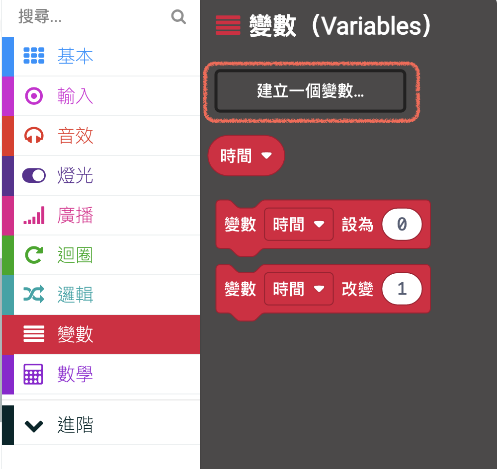
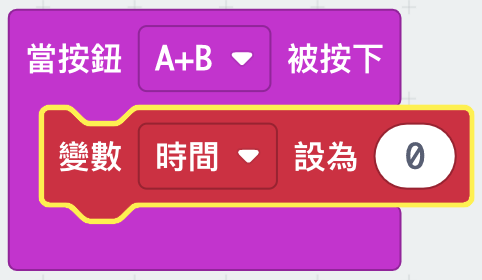
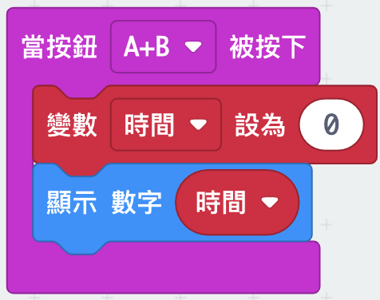

## Setting up your timer

Let's set your timer to 0 when buttons A and B are pressed together.

+ Go to <a href="http://rpf.io/microbit-new" target="_blank">rpf.io/microbit-new</a> to start a new project in the MakeCode (PXT) editor. Name your project 'Timer'.

+ Delete the `on start` and `forever` blocks, as you don't need them.

+ Add a new `on button pressed event` and select `A+B`:.

	

+ Click the 'Variables' then 'Make a variable', and create a new variable called `time`.

	

+ When buttons A and B are pressed together, you want the `time` to be set to `0`. To do this, drag a `set` block into your `on button A+B pressed` block:

	

The default value of zero is what you need. 

+ You should also display the `time`. To do this, drag in a `show number` block and drag your `time` variable into it:

	

+ Click 'run' to test your code. Press the 'A+B' button (below the micro:bit) to set your timer to 0.

	

