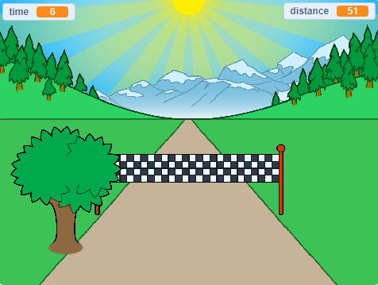

## What next?

Take a look at the [Sprint](https://projects.raspberrypi.org/en/projects/sprint) Scratch project.

You are going to learn how to create your own sprint game, in which you have to use the left and right arrow keys to get to the finish line as quickly as you can.

--- no-print ---

  <iframe allowtransparency="true" width="485" height="402" src="https://scratch.mit.edu/projects/embed/298930696/?autostart=false" frameborder="0" scrolling="no"></iframe>
  

--- /no-print ---

--- print-only ---

--- /print-only ---