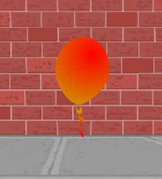

## Random balloons

--- task ---

With the code you have now, your balloon will always start in the same place and move in the same path. 

Click the flag a few times to start your program, and you'll see it's the same every time.

--- /task ---

--- task ---

Instead of using the same x and y position each time, you can let Scratch `pick a random number`{:class="blockoperators"} instead. Change your balloon's code, so that it looks like this:


```blocks3
	when flag clicked
	go to x:(pick random (-150) to (150)) y:(pick random (-150) to (150))
	point in direction (45 v)
	forever
		move (1) steps
		if on edge, bounce
	end
```

If you click the green flag a few times, you should notice that your balloon starts in a different place each time.

--- /task ---

--- task ---

You could even use a random number to choose a random balloon colour each time:



--- hints ---

--- hint ---

`Change the color effect by`{:class="block3looks"} by a `random number`{:class="block3operators"} when the `green flag is clicked`{:class="block3events"}. 

--- /hint ---

--- hint ---

You will need to add these blocks to your code.

```blocks3
(pick random (0) to (200)

change [colour v] effect by (25)
```

--- /hint ---

--- hint ---

You code should look like this:


```blocks3
	when flag clicked
	go to x:(pick random (-150) to (150)) y:(pick random (-150) to (150))
	point in direction (45 v)
	change [colour v] effect by (pick random (0) to (200))
	forever
		move (1) steps
		if on edge, bounce
	end
```

--- /hint ---


--- /hints ---

--- /task ---

What happens if this code is put at the start of your program? Does anything different happen if you put this code _inside_ the `forever`{:class="block3control"} loop? Which do you prefer?

