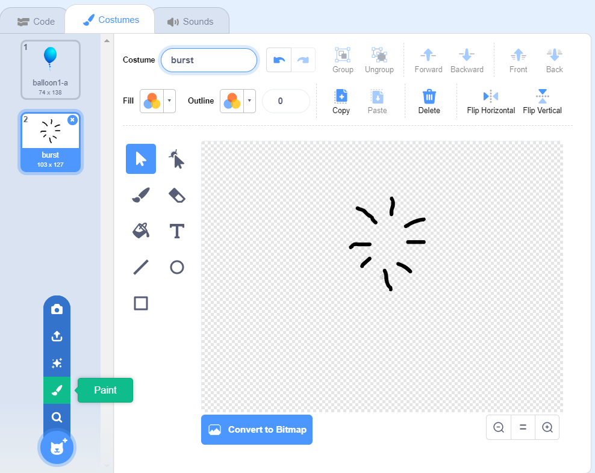

## Popping balloons

Lets allow the player to pop the balloons!

--- task ---

Click on your balloon sprite, and then click the **Costumes** tab. You can delete all of the other costumes, just leaving 1 balloon costume. Add a new costume, by clicking **Paint new costume** and create a new costume called `burst`.



--- /task ---

--- task ---

Make sure that your balloon switches to the right costume when the game starts. Your code should now look like this:


```blocks3
when flag clicked
+switch costume to (balloon1-a v)
point in direction (pick random (-90) to (180))
go to x:(pick random (-150) to (150)) y:(pick random (-150) to (150))
change [color v] effect by (pick random (0) to (200))
forever
	move (1) steps
	if on edge, bounce
end
```

--- /task ---

--- task ---

To allow the player to burst a balloon, add this code:


```blocks3
	when this sprite clicked
	switch costume to (burst v)
	start sound (pop v)
```

--- /task ---

--- task ---

Test out your project. Can you pop the balloon? Does it work as you expected? 

You'll need to improve this code, so that when the balloon is clicked, it shows the `burst` costume for a short time, and is then hidden. 

You can make all of this happen by changing your balloon `when sprite clicked`{:class="block3events"} code to this:


```blocks3
when this sprite clicked
switch costume to (burst v)
start sound (pop v)
+ wait (0.3) seconds
+ hide
```

--- /task ---

--- task ---

Now that you're deleting the balloon when it's clicked, you'll also need to add a `show`{:class="block3looks"} block to the start of the `when flag clicked`{:class="block3events"} code.


```blocks3
when flag clicked
+ show
switch costume to (balloon1-a v)
point in direction (pick random (-90) to (180))
```

--- /task ---

--- task ---

Try popping a balloon again, to check that it works properly. 

--- /task ---
