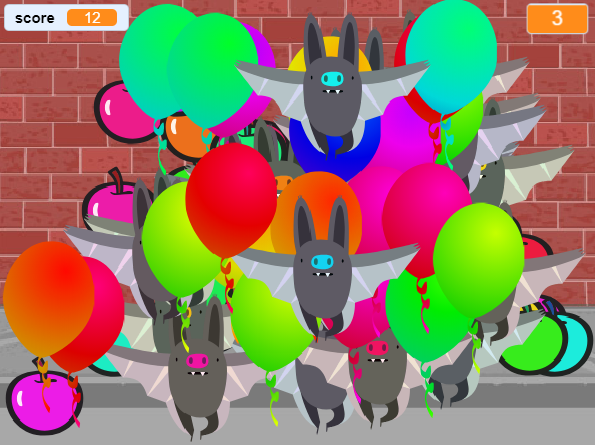

## Challenge: More objects
Can you add in other objects to your game? You can add good objects, like donuts, that give you lots of points, or bad objects, like bats, that take points away.

You'll need to think about the objects you're adding. Think about:

+ How many will there be?
+ How big is it? How does it move?
+ How many points will you score (or lose) for clicking it?
+ Will it move faster or slower than the balloons?
+ What will it look/sound like when it's been clicked?

If you need help adding another object, you can reuse the previous steps!

