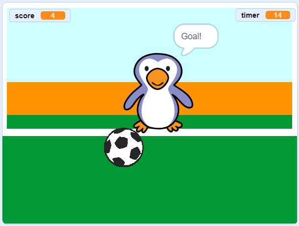

--- no-print ---

This is the **Scratch 3** version of the project. There is also a [Scratch 2 version of the project](https://projects.raspberrypi.org/en/projects/beat-the-goalie-scratch2).

--- /no-print ---

## Introduction

In this project you'll learn how to create a 2 player football game in which you have to score as many goals as you can in 30 seconds.

### What you will make

--- no-print ---

Click the green flag to begin. Use the left and right arrow keys to control the goalie and press <kbd>space</kbd> to kick the ball.

  <iframe allowtransparency="true" width="485" height="402" src="https://scratch.mit.edu/projects/embed/285942132/?autostart=false" frameborder="0" scrolling="no"></iframe>

--- /no-print ---

--- print-only ---

--- /print-only ---

--- collapse ---
---
title: What you will learn
---

- Recall how to use code to respond to key presses
- Use sensing blocks to detect when sprites touch each other
- Use broadcast blocks to communicate between sprites

--- /collapse ---

--- collapse ---
---
title: What you will need
---

#### Hardware

+ A computer capable of running Scratch 3

#### Software

+ Scratch 3 (either [online](http://rpf.io/scratchon){:target="_blank"} or [offline](http://rpf.io/scratchoff){:target="_blank"})

#### Downloads

The starter project can be found [here](http://rpf.io/p/en/beat-the-goalie-go){:target="_blank"}.

--- /collapse ---

--- collapse ---
---
title: Additional information for educators
---

--- no-print ---

If you need to print this project, please use the [printer-friendly version](https://projects.raspberrypi.org/en/projects/beat-the-goalie/print){:target="_blank"}.

--- /no-print ---

You can find the [completed project here](http://rpf.io/p/en/beat-the-goalie-get){:target="_blank"}.

--- /collapse ---
