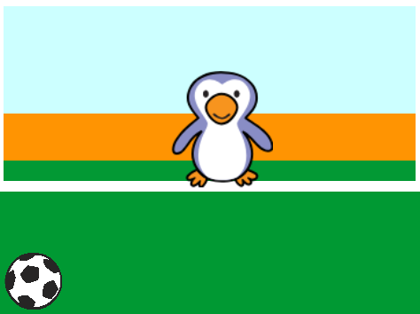

## Moving the football

Let's code the ball to move across the bottom of the stage.

--- task ---

Open the 'Beat the Goalie' Scratch starter project.

**Online**: open the starter project at [rpf.io/beat-the-goalie-on](http://rpf.io/beat-the-goalie-on){:target="_blank"}.

If you have a Scratch account you can make a copy by clicking **Remix**.

**Offline**: open the [starter project](http://rpf.io/p/en/beat-the-goalie-go){:target="_blank"} in the offline editor.

If you need to download and install the Scratch offline editor, you can find it at [rpf.io/scratchoff](http://rpf.io/scratchoff){:target="_blank"}.

In the starter project, you should see a goal backdrop, a football and goalie sprite.



--- /task ---

--- task ---

Click on your football sprite. Add this code, so that the football moves along the bottom of the screen until the space bar is pressed.


```blocks3
when green flag clicked
repeat until <key (space v) pressed?>
move (10) steps
if on edge, bounce
end
```

--- /task ---

--- task ---

Click the green flag to test your project. Your football should bounce along the bottom of the screen until the space bar is pressed.


--- /task ---

--- task ---

Add this code to your football sprite, so that the football moves towards the goal after the space bar has been pressed.


```blocks3
when green flag clicked
repeat until <key (space v) pressed?>
move (10) steps
if on edge, bounce
end
+ repeat (15)
change y by (10)
end
```

--- /task ---

--- task ---

Click the green flag to test your code. This time, press the space bar and your football should move towards the goal.


--- /task ---

--- task ---

Click the green flag to test your code. What happens if you click the flag a second time? Can you fix the problem?

--- hints ---

--- hint ---

After the `green flag is clicked`{:class="block3events"} the sprite will have to `go to`{:class="block3motion"} back to the start.

--- /hint ---

--- hint ---

You will need this block:

```blocks3
go to x:(-200) y:(-140)
```

--- /hint ---

--- hint ---

Your code should look like this:


```blocks3
when green flag clicked
+ go to x:(-200) y:(-140)
repeat until <key (space v) pressed?>
move (10) steps
if on edge, bounce
end
repeat (15)
change y by (10)
end
```

--- /hint ---

--- /hints ---

--- /task ---

