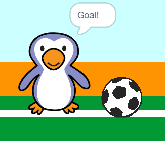

## Goal!

--- task ---

Can you play a sound and code your goalie to say 'Goal!' when a goal has been scored?

Remember that a goal has been scored if the ball is not touching the goalie.



--- hints ---

--- hint ---

`If the football is not`{:class="block3control"} `touching the goalie`{:class="block3sensing"} your program should `start the cheer sound`{:class="block3sound"} and `broadcast a goal message`{:class="block3events"}.

`When the goalie receives the goal message`{:class="block3events"} it should `say goal`{:class="block3looks"}.

--- /hint ---

--- hint ---

You will need these blocks:

```blocks3
broadcast (goal v)

say [Goal!] for (1) seconds

when I receive [goal v]

start sound (cheer v)
```

--- /hint ---

--- hint ---

Your code should look like this:


```blocks3
if <touching (goalie v)> then
start sound (rattle v)
broadcast (save v)
else
+ start sound (cheer v)
+ broadcast (goal v)
end
```


```blocks3
when I receive [goal v]
say [Goal!] for (1) seconds
```

--- /hint ---


--- /hints ---


--- /task ---
