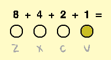
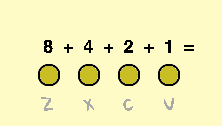

## Key presses

How many notes can you play with four keys? It might be more than you think!

--- task ---

Open the 'Binary hero' Scratch starter project.

**Online:** open the starter project at [rpf.io/binary-hero-on](http://rpf.io/binary-hero-on){:target="_blank"}. If you have a Scratch account, you can click on **Remix** in the top right-hand corner to save a copy of the project.

**Offline:** open the [starter project](http://rpf.io/p/en/binary-hero-go){:target="_blank"}in the offline editor. If you need to download and install the Scratch offline editor, you can find it at [rpf.io/scratchoff](http://rpf.io/scratchoff){:target="_blank"}.

--- /task ---

Start by showing which key is being pressed. 

--- task ---

Click on the sprite called '1', and add code to change the sprite's costume if the `v` key is pressed.


```blocks3
when flag clicked
forever
if < key (v v) pressed?> then
switch costume to (on v)
else
switch costume to (off v)
end
```

When you test your code by pressing the <kbd>v</kbd> key, the sprite should light up.



--- /task ---

--- task ---

Do the same for the other three sprites so that they light up if the <kbd>z</kbd>, <kbd>x</kbd>, or <kbd>c</kbd> keys are pressed.



--- /task ---
