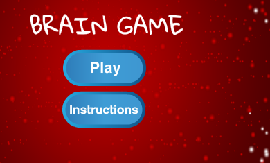

## Challenge: instruction screen

Can you add an instructions screen that tells the player how to play the game? For this, you need an 'Instructions' button, and another Stage backdrop.



You may also need to add a 'Back' button that lets the player go back to the start screen.

```blocks3
	broadcast (start screen v)
```
