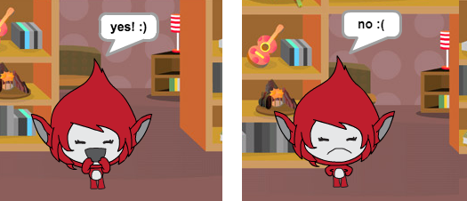

## Challenge: add a score and reactions

Can you add a score to your game?

You could add code so that the player scores a point for every correct answer. If you're feeling mean, you could also add code to reset the player's score to zero if they give a wrong answer!

[[[generic-scratch3-high-score]]]

Can you make your character react to the player's answer by changing to a different costume if the answer is correct or incorrect?

