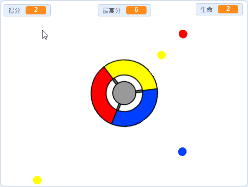

## 然後呢？

試試[抓住點點](https://projects.raspberrypi.org/en/projects/catch-the-dots?utm_source=pathway&utm_medium=whatnext&utm_campaign=projects)專案，創作一個反應類的遊戲！ 在專案中，你會學到如何建立角色的分身，以及如何用變數加快遊戲進行的速度。

\--- no-print \---

使用鍵盤的方向鍵旋轉控制輪，並在飛入的點點到達前用一樣的顏色接住它們，如果失誤三次，遊戲就結束。

  <iframe allowtransparency="true" width="485" height="402" src="https://scratch.mit.edu/projects/embed/252923761/?autostart=false" frameborder="0" scrolling="no"></iframe>
  

\--- /no-print \---

\--- print-only \---

\--- /print-only \---