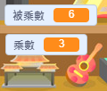

## 建立問題

讓我們從建立隨機問題供玩家回答開始。


+ 啟動一個新的 Scratch 專案，刪除貓子圖，使專案清空。你可以在 <a href="http://jumpto.cc/scratch-new" target="_blank">jumpto.cc/scratch-new</a> 找到線上 Scratch 編輯器。

+ 為你的遊戲選擇一個角色和背景。你可以選擇任何你喜歡的！示例：

	

+ 建立 2 個被稱作 `數字 1`{:class="blockdata"} 和 `數字 2`{:class="blockdata"} 的新變數。這些變數將儲存要進行相乘的 2 個數字。

	

+ 向你的角色新增程式碼，將這些變數均設定為 2 和 12 之間的 `隨機`{:class="blockoperators"} 數字。

	```blocks
		點選綠旗時
		變數 [number 1 v] 設為 (隨機取數 (2) 到 (12))
		變數 [number 2 v] 設為 (隨機取數 (2) 到 (12))
	```

+ 隨後，你可以讓玩家給出答案，並告知其答案正確與否。

	```blocks
		點選綠旗時
		變數 [number 1 v] 設為 (隨機取數 (2) 到 (12))
		變數 [number 2 v] 設為 (隨機取數 (2) 到 (12))
		詢問 (字串組合 (number 1) 和 (字串組合 [ x ] 和 (number 2))) 並等待
		如果 <(answer) = ((number 1) * (number 2))> 那麼 
  			說出 [yes! :)] (2) 秒

  			說出 [nope :(] (2) 秒
		end
	```

+ 通過正確回答一個問題和錯誤回答一個問題，對你的專案進行充分測試。

+ 圍繞此程式碼新增一個 `永遠`{:class="blockcontrol"} 迴圈，以詢問玩家大量問題。

+ 使用被稱作 `時間`{:class="blockdata"} 的變數，在工作區上建立一個倒數計時器。如果你需要幫助，“魔鬼剋星”專案有製作計時器的說明（在第 5 步）！

+ 再次測試你的專案 - 你應該能夠持續提出問題，直到時間結束。


