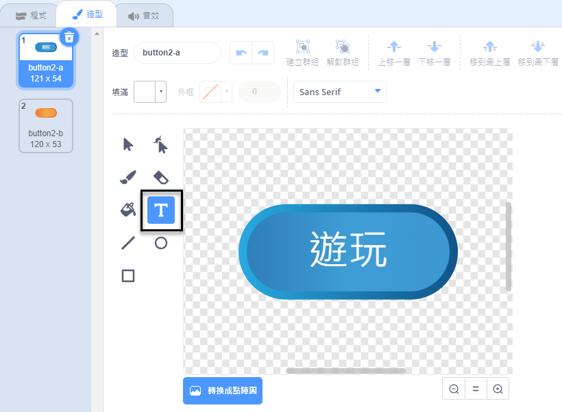
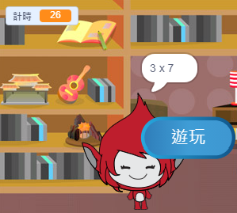
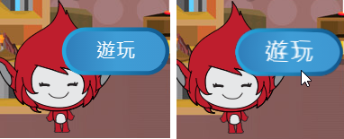

## 重複遊戲

讓我們來向你的遊戲新增一個“開始遊戲”按鈕，以便你能重複進行遊戲。


+ 建立一個新的“開始遊戲”按鈕子圖，你的玩家可點選該按鈕以開始一局新遊戲。你可以自行繪製子圖，或者編輯 Scratch 庫中的子圖。

	

+ 向你的新按鈕新增此程式碼。

	```blocks
		點選綠旗時
		顯示

		當角色被點選
		隱藏
		廣播訊息 [start v]
	```

	此程式碼在你的專案開始時顯示開始遊戲按鈕。點選按鈕時，按鈕被隱藏，然後播放開始遊戲的訊息。

+ 你將需要編輯你的角色程式碼，使得遊戲在接收到 `開始`{:class="blockevents"} 訊息而非點選旗幟時開始。

	用 `我收到開始時`{:class="blockevents"} 替代 `點選旗幟時`{:class="blockevents"} 程式碼。

	

+ 點選綠色旗幟，然後點選新的開始遊戲按鈕進行測試。你會看到在點選按鈕後遊戲才會啟動。

+ 你是否注意到了計時器是在點選綠色旗幟而非遊戲啟動時開始計時？

	

	你能否解決這個問題？

+ 在工作區上點選，用 `結束`{:class="blockevents"} 訊息替代 `停止所有`{:class="blockcontrol"} 模組。

	

+ 你現在可以向你的按鈕新增程式碼，以在每局遊戲結束時再次顯示該按鈕。

	```blocks
		當收到訊息 [end v]
		顯示
	```

+ 你還需要在每局遊戲結束時阻止你的角色問問題：

	```blocks
		當收到訊息 [end v]
		停止 [角色的其他程式 v]
	```

+ 通過玩一組遊戲來測試你的開始遊戲按鈕。你會注意到開始遊戲按鈕會在每局遊戲之後顯示。為簡化測試，你可以縮短每局遊戲的時間，使其僅持續幾秒鐘。

	```blocks
		變數 [時 v] 設為 [10]
	```

+ 你甚至可以更改按鈕在滑鼠懸停在其上方時的樣式。

	```blocks
		點選綠旗時
		顯示
		重複無限次 
  		如果 <碰到 [滑鼠 v] ?> 那麼 
    			效果 [魚眼 v] 設為 (30)
  
    			效果 [魚眼 v] 設為 (0)
  		end
		end
	```

	


