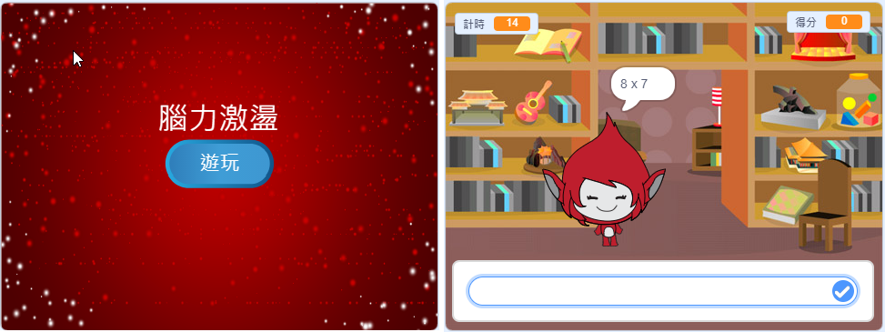

## 挑戰：設計初始畫面

你能添加另一個背景，做為一開始進入遊戲的畫面嗎？

你可以利用`當收到訊息開始`{:class="block3events"}以及`當收到訊息結束`{:class="block3events"}兩個積木來切換舞台的背景。

如果背景切換後，要顯示或隱藏一些角色，可以用`顯示`{:class="block3looks"}與`隱藏`{:class="block3looks"}積木。

如果只需要在遊戲進行時才顯示得分與計時，可以用`變數顯示`{:class="block3variables"}和`變數隱藏`{:class="block3variables"}積木。

