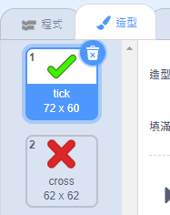
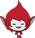
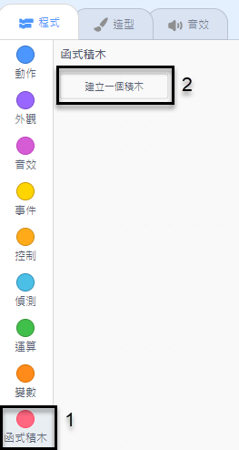
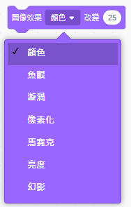

## 添加圖像效果

遊戲設計到目前為止，Giga 只會說`答對！`或`答錯！`來回應玩家。加入一些表情，讓玩家知道他們的回答是否正確。

\--- task \---

創建一個名為「結果」的角色，並從造型庫中挑選 tick（勾）和 cross（叉）做為角色造型。



\--- /task \---

\--- task \---

修改 Giga 的程式，把說出積木替換成`廣播`{:class="block3events"}「正確」或「錯誤」訊息。



```blocks3
如果 <(詢問的答案) = ((被乘數)*(乘數))> 那麼

- 說出 (答對！) 持續 (2) 秒
+ 廣播訊息 (正確 v)
否則
- 說出 (答錯！) 持續 (2) 秒
+ 廣播訊息 (錯誤 v)
end
```

\--- /task \---

\--- task \---

現在你可以利用這些訊息來`顯示`{:class="block3looks"}勾勾或叉叉造型。添加以下程式到「結果」角色：


```blocks3
    當收到訊息 (正確 v)
    造型換成 (tick v)
    顯示
    等待 (1) 秒
    隱藏

    當收到訊息 (錯誤 v)
    造型換成 (cross v)
    顯示
    等待 (1) 秒
    隱藏

    當 @greenflag 被點擊
    隱藏
```

\--- /task \---

\--- task \---

再試試遊戲，每當你答對，你應該會看到打勾；當你答錯，你應該會看到打叉！


\--- /task \---

有看到嗎？`當收到訊息正確`{:class="block3events"}和`當收到訊息錯誤`{:class="block3events"}的程式幾乎一模一樣。

為了後面更輕鬆的修改程式，我們先用函式來做出自己的積木。

\--- task \---

選取「結果」角色， 接著在工具箱找到`函式積木`{:class="block3myblocks"}，點擊**建立一個積木**。 創建一個新的積木，並把它命名為`動畫`{:class="block3myblocks"}。




\--- /task \---

\--- task \---

把「結果」角色中`顯示`{:class="block3looks"}到`隱藏`{:class="block3looks"}的程式片段挪到`動畫`{:class="block3myblocks"}積木下，作為這個積木的定義：


```blocks3
定義 動畫
顯示
等待（1）秒
隱藏
```

\--- /task \---

\--- task \---

檢查一下，務必要**刪除兩個**`造型換成`{:class="block3looks"}積木下的`顯示`{:class="block3looks"}與`隱藏`{:class="block3looks"}的程式。

接著，在`造型換成`{:class="block3looks"}積木下改放`動畫`{:class="block3myblocks"}積木：


```blocks3
    當收到訊息 (正確 v)
    造型換成 (tick v)
    動畫:: custom

    當收到訊息 (錯誤 v)
    造型換成 (cross v)
    動畫:: custom
```

\--- /task \---

有了自定義的`動畫`{:class="block3myblocks"}積木，之後要對動畫做修改，只要改一個地方就可以了。

\--- task \---

修改程式，讓 tick 和 cross 造型在顯示時持續 2 秒。

\--- /task \---

\--- task \---

我們把`顯示`{:class="block3looks"}還有`隱藏`{:class="block3looks"} 勾或叉造型的外觀改掉，改成淡入的外觀`動畫`{:class="block3myblocks"}。


```blocks3
    定義 動畫
    圖像效果 [幻影 v]設為 (100)
    顯示
    重複 (25) 次
        圖像效果 [顏色 v] 改變 (-4)
    end
    隱藏
```

\--- /task \---

你還可以改進勾或叉的圖像動畫嗎？比方說你可以讓造型「淡出」，或是其它圖像效果：

