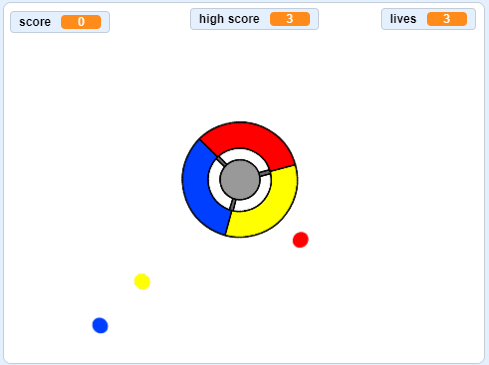

--- no-print ---

This is the **Scratch 3** version of the project. There is also a [Scratch 2 version of the project](https://projects.raspberrypi.org/en/projects/catch-the-dots-scratch2).

--- /no-print ---

## Introduction

In this project you'll learn how to create a game in which the player has to match up coloured dots with the correct colour of the controller wheel.

--- no-print ---

Use the arrow keys on your keyboard to rotate the controller wheel and catch the flying dots as they reach the centre. If you miss three dots, the game is over.

  <iframe allowtransparency="true" width="485" height="402" src="https://scratch.mit.edu/projects/embed/252923761/?autostart=false" frameborder="0" scrolling="no"></iframe>
  

--- /no-print ---

--- print-only ---

--- /print-only ---

--- collapse ---
---
title: What you will learn
---
+ How to choose random items from a list
+ How to use variables to track speed, lives, and the player's score

--- /collapse ---

--- collapse ---
---
title: What you will need
---

### Hardware

+ A computer capable of running Scratch 3

### Software

+ Scratch 3 (either [online](http://rpf.io/scratchon){:target="_blank"} or [offline](http://rpf.io/scratchoff){:target="_blank"})

### Downloads

+ [Offline Scratch 2 project](http://rpf.io/p/en/catch-the-dots-go){:target="_blank"}

--- /collapse ---

--- collapse ---
---
title: Additional notes for educators
---

--- no-print ---

If you need to print this project, please use the [printer-friendly version](https://projects.raspberrypi.org/en/projects/catch-the-dots/print).

--- /no-print ---

You can find [the completed project here](http://rpf.io/p/en/catch-the-dots-get){:target="_blank"}.

You can find the [completed project here](https://scratch.mit.edu/projects/252923761/#editor){:target="_blank"}

--- /collapse ---
