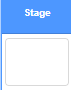
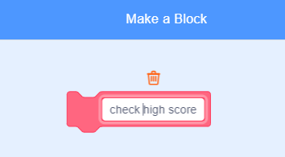

## High score

You're going to save the game's high score, so that players can see how well they are doing.

--- task ---

Create a new variable called `high score`{:class="block3variables"}.



--- /task ---

--- task ---

Select the Stage. Click on 'My blocks' and create a new custom block called `check high score`{:class="block3myblocks"}.




--- /task ---

--- task ---

Add code to your custom block so that the block checks if the current value of `score`{:class="block3variables"} in larger than the value of the `high score`{:class="block3variables"} variable, and then stores the value of `score`{:class="block3variables"} as the new value of `high score`{:class="block3variables"}.


```blocks3
	define check high score
	if <(score :: variables) > (high score)> then
		set [high score v] to (score :: variables)
	end
```

--- /task ---

--- task ---

Add your new custom block to the Stage script before the end of the script.


```blocks3
when flag clicked
set [lives v] to (3)
set [score v] to (0)
wait until <(lives) < (1)>
+ check high score :: custom
stop [all v]
```

--- /task ---

--- task ---

Play your game twice to check whether your score gets correctly saved as the `high score`{:class="block3variables"}.

--- /task ---
