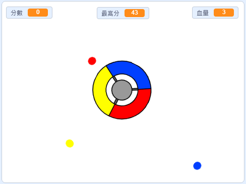

\--- no-print \---

這個專案是 **Scratch 3** 版本。 另外還有 [Scratch 2](https://projects.raspberrypi.org/en/projects/catch-the-dots-scratch2) 版本。

\--- /no-print \---

## 介紹

在這個專案中，你將學習創建一個遊戲，玩家必須將不同顏色的點點與控制輪的顏色進行匹配。

\--- no-print \---

使用鍵盤的方向鍵旋轉控制輪，並在飛入的點點到達前用一樣的顏色接住它們， 如果失誤三次，遊戲就結束。

  <iframe allowtransparency="true" width="485" height="402" src="https://scratch.mit.edu/projects/embed/252923761/?autostart=false" frameborder="0" scrolling="no"></iframe>
  

\--- /no-print \---

\--- print-only \---

\--- /print-only \---

## \--- collapse \---

## title: 你會學到

+ 如何從清單中選擇隨機項目
+ 如何使用變數來記錄速度、生命和玩家得分

\--- /collapse \---

## \--- collapse \---

## title: 你會用到

### 硬體

+ 可運行 Scratch 3 的電腦

### 軟體

+ Scratch 3（[線上版](http://rpf.io/scratchon){:target="_blank"} 或 [離線版](http://rpf.io/scratchoff){:target="_blank"}）

### 下載

+ 材料包可[由此下載](http://rpf.io/p/en/catch-the-dots-go){:target="_blank"}

\--- /collapse \---

## \--- collapse \---

## title: 給教師的其它資訊

\--- no-print \---

如果你需要列印這個專案，可以先切換成[列印友好模式](https://projects.raspberrypi.org/en/projects/catch-the-dots/print)。

\--- /no-print \---

你可以在這裡找到[已經完成的專案](http://rpf.io/p/en/catch-the-dots-get){:target="_blank"}。

你可以在這裡找到[已經完成的專案](https://scratch.mit.edu/projects/252923761/#editor){:target="_blank"}。

\--- /collapse \---