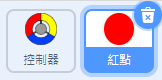
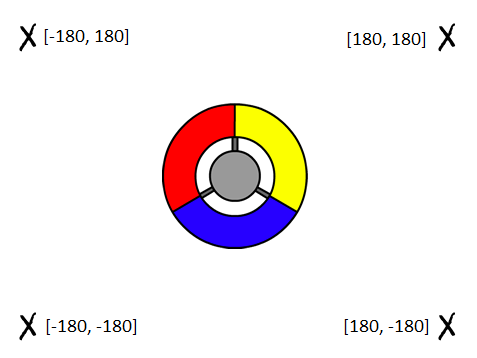
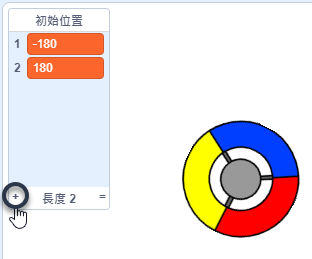

## 得分或失血

現在你將加入玩家要收集的小點點。

\--- task \---

創建一個名為「紅點」的角色。 角色的造型就是一個紅色的小點點。



\--- /task \---

\--- task \---

在紅點上寫個程式，讓它每隔幾秒就建立分身：


```blocks3
    當 @greenflag 被點擊
    隱藏
    等待 (2) 秒
    重複無限次
        建立 (自己 v) 的分身
        等待 (隨機取數 (5) 到 (10)) 秒
    end
```

\--- /task \---

如果你現在點擊綠旗，會發現沒有任何反應。 這是因為角色和分身在同一個位置顯示，所以你看不出來有分身。

所以接著我們要添加程式，讓每個新的分身產生時，分佈在場景四個角落中的其中一個。



\--- task \---

建立一個新的清單，名稱為`初始位置`{:class="block3variables"}，點擊舞台上清單視窗的加號 `(+)` 圖示，添加 `-180`{:class="block3variables"} 和 `180`{:class="block3variables"} 兩個項目。




[[[generic-scratch3-make-list]]]

接著，你可以取消勾選這個清單，讓它隱藏起來，不要顯示在舞台：


\--- /task \---

注意遊戲場景的角落座標是由 `180` 和 `-180` 兩個數值的組合（儘管舞台最寬是 480 而不是 360 點）。 這樣一來，你所定位的位置就可以隨機使用清單的兩個項目。

\--- task \---

把這個程式添加到紅點上，讓新的分身隨機的出現在某一角，然後朝著控制器慢慢移動。


```blocks3
    當分身產生
    定位到 x:((初始位置 v)的第(隨機取數 (1) 到 (2))項) y:((初始位置 v)的第(隨機取數 (1) 到 (2))項)
    面朝 (控制器v) 向
    顯示
    重複直到 <碰到 (控制器 v)？>
        移動 (1) 點
    end
```

\--- /task \---

這個程式會選擇用 `-180` 或 `180` 來作為 x 和 y 的座標值，這樣一來，紅點分身的初始位置就會是場景的某個角落。

\--- task \---

測試你的專案。 你應該會看到紅點在場景某一角開始向控制器前進。


\--- /task \---

\--- task \---

建立兩個變數，分別叫`血量`{:class="block3variables"} and `分數`{:class="block3variables"}。


\--- /task \---

\--- task \---

在舞台撰寫程式，設定`血量`{:class="block3variables"}在遊戲一開始為 `3`，再設定`分數`{:class="block3variables"}一開始為 `0`。 

```blocks3
當 @greenflag 被點擊
變數 [血量 v] 設為 (3)
變數 [分數 v] 設為 (3)
```

\--- /task \---

\--- task \---

添加程式到舞台，在玩家失血過多時結束遊戲。


```blocks3
    等待直到 <(血量 :: variables ) < (1)>
    停止 [全部 v]
```

\--- /task \---

玩家應該要在抓到點點時得分，沒抓到的話就會被點點撞到而失血。 而只有在控制器上的色塊碰到相同顏色的點點時，才算抓到點點。

\--- task \---

切換到紅點的程式頁籤，在`當分身產生`{:class="block3control"}的程式後面再添加一些程式。

首先，要讓點點碰到控制器後再`移動 5 點`{:class="block3motion"}，這樣子點點才能與控制器上的色塊重疊。

接著，如果點點分身與控制器色塊的顏色一樣，就加 `1` 分的`分數`{:class="block3variables"}；如果顏色不一樣，就減 `1` 滴的`血量`{:class="block3variables"}。

[[[generic-scratch3-sound-from-library]]]


```blocks3
    移動 (5) 點
    如果 <碰到顏色 (#ff0000)？> 那麼
        變數 [分數 v] 改變 (1)
        播放音效 (pop v) 直到結束
    否則
        變數 [血量 v] 改變 (-1)
        播放音效 (Laser1 v) 直到結束
    end
    分身刪除
```

\--- /task \---

\--- task \---

測試你的遊戲，檢查：

1. 沒抓到點點時（也就是顏色不一樣）會不會失血。
2. 當抓到點點時（也就是顏色一樣時）會不會得分。

\--- /task \---