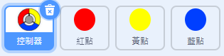
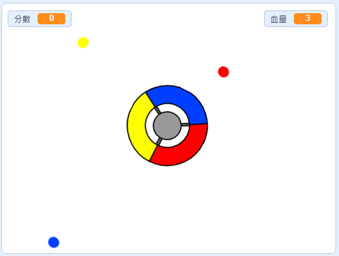
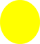

## 更多點點

\--- task \---

複製你的「紅點」角色兩次，並將兩個新的角色分別命名為「黃點」和「藍點」。



\--- /task \---

\--- task \---

修改每個角色的造型，黃點的造型應該是黃色的，而藍點角色則是藍色造型。

\--- /task \---

\--- task \---

修改每個角色的程式，點點的顏色應該要與碰到的控制器色塊一樣才能得分。



\--- hints \---

\--- hint \---

下面是你要找到並替換的兩個角色的程式：


```blocks3
    如果 <碰到顏色 (#ff0000)？> 那麼
        變數 [分數 v] 改變 (1)
        播放音效 (sound v) 直到結束
        ...
    end
```

\--- /hint \---

\--- hint \---

這是黃點角色程式要修改的程式：

```blocks3
    如果 <碰到顏色 (#ffff00)？ > 那麼
        變數 [分數 v] 改變 (1)
        播放音效 (pop v) 直到結束
    end
```

這是藍點角色的程式修改後的樣子：

```blocks3
    如果 <碰到顏色 (#0000ff)？ > 那麼
        變數 [分數 v] 改變 (1)
        播放音效 (pop v) 直到結束
    end
```

\--- /hint \---

\--- /hints \---

\--- /task \---

如果你現在試玩遊戲，應該會發現，有時不同色的點點會同時出現在一樣的角落。

\--- task \---

修改黃點，讓它在綠旗點擊時等待 4 秒再出現。



```blocks3
    當 @greenflag 被點擊
    隱藏
+   等待 (4) 秒
```


接著再修改藍點，讓它在遊戲開始後等待 6 秒再開始運行。

\--- /task \---