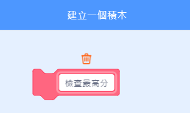

## 最高分紀錄

你將記錄遊戲的最高分，讓玩家看看自己的表現能不能超越。

\--- task \---

建立一個名為`最高分`{:class="block3variables"}的新變數。


\--- /task \---

\--- task \---

選擇舞台。 點擊工具箱中的「函式積木」，然後建立一個新的積木，名為`檢查最高分`{:class="block3myblocks"}。




\--- /task \---

\--- task \---

在「定義檢查最高分」的積木下面撰寫程式，如果`分數`{:class="block3variables"}變數裡的值比`最高分`{:class="block3variables"}的值還大，那麼就把`分數`{:class="block3variables"}的值儲存到`最高分`{:class="block3variables"}變數裡。


```blocks3
    定義 檢查最高分
    如果 <(分數) > (最高分)> 那麼
        變數 [最高分 v] 設為 (分數)
    end
```

\--- /task \---

\--- task \---

把這個你定義好的新積木放到遊戲停止前，在遊戲結束前檢查最高分。


```blocks3
當 @greenflag 被點擊
變數 [血量 v] 設為 (3)
變數 [分數 v] 設為 (0)
等待直到 <(血量) < (50)>

+ 檢查最高分 :: custom
停止 [全部 v]
```

\--- /task \---

\--- task \---

玩遊戲兩次，看看你的遊戲得分是不是會正確被記錄在`最高分`{:class="block3variables"}裡。

\--- /task \---