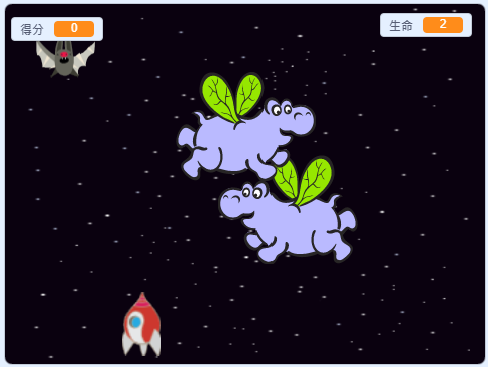

## 然後呢？

試試下一個專案，[分身大戰](https://projects.raspberrypi.org/en/projects/clone-wars?utm_source=pathway&utm_medium=whatnext&utm_campaign=projects)，你要製作一個遊戲，玩家必須駕駛飛船打敗會自行分裂、自我繁殖的太空怪物，拯救地球。 在專案中會用到你學過的的技巧，像是角色分身和添加得分！

\--- no-print \---

點擊綠旗開始，用鍵盤上的<kbd>向左鍵</kbd>、<kbd>向右鍵</kbd>移動太空船，用<kbd>空白鍵</kbd>射擊。

  <iframe allowtransparency="true" width="485" height="402" src="https://scratch.mit.edu/projects/embed/276887163/?autostart=false" frameborder="0" scrolling="no"></iframe>
  

\--- /no-print \---

若你架駛的飛船射擊到太空河馬可以得分， 如果被河馬撞到或被蝙蝠丟出的橘子打到，飛船就會爆炸。

\--- print-only \---

\--- /print-only \---