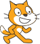

## Get to safety

The object of the game is to guide the cats to safety by creating a path so they can reach the door. Create a score variable to keep track of how many cats reach the door.

--- task ---

Create a variable called `score`{:class="block3variables"}.



[[[generic-scratch3-add-variable]]]

--- /task ---

--- task ---

Add code to your cat sprite to add `1` to the `score`{:class="block3variables"} each time a cat reaches the door. Also set `score`{:class="block3variables"} to `0` `when the flag is clicked`{:class="block3events"} at the start of the game.


--- hints ---
--- hint ---

`If`{:class="block3control"} the cat is `touching the door sprite`{:class="block3sensing"}, then `add 1 to the score`{:class="block3variables"}.

--- /hint ---

--- hint ---

Here are the new code blocks you need to add to your `when I start as a clone` script:

```blocks3
change [score v] by (1)

if <> then
end

<touching (Door v)?>

set [score v] to (0)
```

--- /hint ---

--- hint ---

This is what your code should look like:

```blocks3
when I start as a clone
show
repeat until <touching (edge v)?>
    move (10) steps
    repeat until <touching color [#0000ff]?>
        change y by (-2)
    end
    repeat until <not <touching color [#0000ff]?>>
        change y by (2)
    end
    next costume
    wait (0.1) seconds
+   if <touching (Door v)?> then
        change [score v] by (1)
    end
end
delete this clone

when flag clicked
+ set [score v] to (0)
```

--- /hint ---

--- /hints ---

--- /task ---

--- task ---

Add some more code so that, when a cat sprite reaches the door, the cat makes a 'meow' sound and then disappears.


```blocks3
play sound (meow v)
delete this clone
```

--- /task ---
