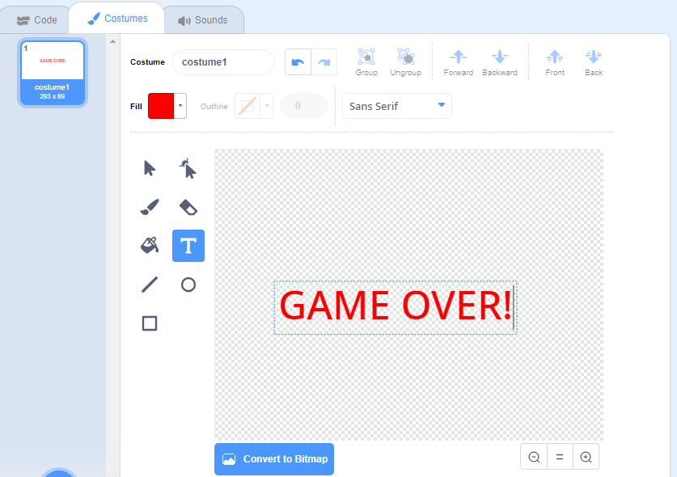

## Game over

Next, you're going to add a 'game over' message at the end of the game.

--- task ---

If you haven't already, create a new variable called `lives`{:class="block3variables"}.

Your spaceship should start with three lives and lose a life whenever it touches a hippo or an orange. Your game should stop when the `lives`{:class="block3variables"} run out.

--- /task ---

--- task ---

Draw a new sprite called `Game Over` using the **text** tool.



--- /task ---

--- task ---

On the Stage, broadcast a `game over`{:class="block3events"} message just before the game ends.


```blocks3
broadcast (game over v) and wait
```

--- /task ---

--- task ---

Add this code to your `Game Over` sprite so that it shows at the end of the game:


```blocks3
when flag clicked
hide

when I receive [game over v]
show
```

Because you've used a `broadcast (game over) and wait`{:class="block3events"} block on your Stage, the Stage will wait for the `Game Over` sprite to be displayed before ending the game.

--- /task ---

--- task ---

Test your game. How many points can you score? If the game is too easy or too hard, can you think of ways to improve it?

--- /task ---
