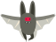

## Space-bat

To make your game a bit harder, you are going to create a bat that throws oranges at the spaceship.


--- task ---

Add a `Bat` sprite and set its rotation style to **left–right**.

--- /task ---

--- task ---

Make the `Bat` sprite `move`{:class="block3motion"} from left to right at the top of the Stage `forever`{:class="block3control"}. 



```blocks3
when flag clicked
set size to (50) %
forever
    move (10) steps
    if on edge, bounce
end
```

Remember to test your code.

--- /task ---

If you look at the bat's costumes, you can see that it has four different ones:


--- task ---

Use the `next costume`{:class="block3looks"} block to make the bat flap its wings as it moves.

--- hints ---

--- hint ---

After the bat has moved, it should show the `next costume`{:class="block3looks"} and then `wait`{:class="block3control"} for a short time.

--- /hint ---

--- hint ---

You need to add these blocks to you code:

```blocks3
wait (0.3) seconds

next costume
```

--- /hint ---

--- hint ---

Your code should look like this:

```blocks3
when flag clicked
set size to (50) %
forever
move (10) steps
if on edge, bounce
+ next costume
+ wait (0.3) seconds
end
```

--- /hint ---

--- /hints ---

--- /task ---

Now make the bat throw oranges!

--- task ---

Add an `Orange` sprite from the Scratch library.


--- /task ---

--- task ---

Add code to your bat so that `when the flag is clicked`{:class="block3events"}, the `Bat` sprite `forever`{:class="block3control"} `waits`{:class="block3control"} for a `random`{:class="block3operators"} length of time between `5 to 10`{:class="block3operators"} seconds and then `creates a clone`{:class="block3control"} of the `Orange` sprite.


```blocks3
when flag clicked
forever
	wait (pick random (5) to (10)) secs
	create clone of (Orange v)
end
```

--- /task ---

--- task ---

Add code to the `Orange` to make each of its clone drop, starting from the `Bat` sprite and falling towards the bottom of the Stage.


```blocks3
	when flag clicked
	hide

	when I start as a clone
	go to (Bat v)
	show
	repeat until <touching (edge v)?
		change y by (-4)
	end
	delete this clone
```

--- /task ---

--- task ---

Add some more code to the `Orange` sprite so that when an `Orange` clone hits the `Spaceship` sprite, the clone also disappears to give the player a chance to reset:


```blocks3
	when I receive [hit v]
	delete this clone
```

--- /task ---

--- task ---

Modify the code of your `Spaceship` sprite so that the sprite is "hit" when it touches a `Hippo` sprite or an `Orange` sprite:


```blocks3
	wait until < <touching (Hippo1 v)?> or <touching (Orange v)?>>
```

--- /task ---

--- task ---

Test your game. What happens if the spaceship gets hit by a falling orange?

--- /task ---

