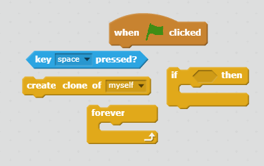
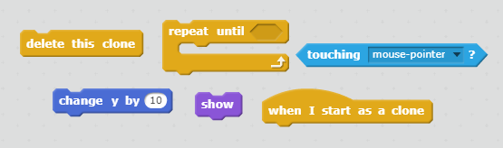

## 闪电球

让我们来赋予宇宙飞船发射闪电球的能力吧！

+ 从 Scratch 库中添加 `闪电` 子图。  

+ 游戏启动时，`闪电` 子图应被隐藏，直至宇宙飞船发射激光炮，所以向 `闪电` 子图添加此代码：

```blocks
点击绿旗时
隐藏
```

此时你的宇宙飞船便可发射非常大的闪电球了！

+ 在你刚刚添加的让 `闪电` 子图变小的代码块下方附上一些代码，使其上下颠倒。然后看起来就像从宇宙飞船中喷射出了两头尖尖的闪电。

```blocks
尺寸设为 (25) %
面朝 (-90 v) 度
```

+ 在工作区下方的子图面板中点击 `宇宙飞船` 子图，以切换到该子图。

+ 添加一些新代码，使得每次按下**空格**键时，`宇宙飞船` 子图都能创建出一个新的闪电球。

--- hints ---
--- hint ---
以下是一些伪代码：

点击绿色旗帜时
不断检查永远
如果按下了**空格**键，则创建克隆的 `闪电` 子图
--- /hint ---
--- hint ---
以下是你将需要的代码块：


--- /hint ---
--- hint ---
以下是你将需要的代码：

```blocks
点击绿旗时
重复无限次 
  如果 <[空格 v] 键被按下？> 那么 
    分身 [Lightning v] 建立
  end
end
```
--- /hint ---
--- /hints ---

+ 切换回 `闪电` 子图。

+ 每创建一个闪电球时，闪电球就会出现，然后向上移动，直至抵达画面顶端。然后就会消失。

--- hints ---
--- hint ---

当一个新的 `闪电` 子图克隆体出现时：
- 将它显示出来
- 使其反复上移 `10` 个坐标，直至其触碰画面边缘
- 然后删除克隆体
--- /hint ---
--- hint ---
以下是你将需要的代码块：


--- /hint ---
--- hint ---
以下是你将需要向 `闪电` 子图添加的代码：

```blocks
	当分身产生
  显示
  重复直到 <碰到 [边缘 v] ?> 
    y 改变 (10)
  end
  分身删除
```
--- /hint ---
--- /hints ---


+ 点击绿色旗帜测试你的 `闪电` 子图，然后按**空格**键。你按**空格**键时，闪电是否出现并向画面上方移动？你能发现什么问题？

--- collapse ---
---
title: 回答
---
糟糕 — 此时，闪电总是从同一位置发射，而不论宇宙飞船在哪里！

将此代码块添加在 `显示`{:class="blocklooks"}代码块前面，使 `闪电` 子图克隆体在出现之前移向 `宇宙飞船` 子图的位置。这将使它看起来像宇宙飞船发射出了闪电球。

```blocks
  定位到 [Spaceship v] 位置
```

--- /collapse ---

+ 按**空格**键来测试你的闪电球现在是否可以正确发射。

--- challenge ---
### 挑战：修复闪电
如果你按住**空格**键会发生什么？你能否使用一个 `等待`{:class="blockcontrol"}代码块修复这个问题？

--- /challenge ---
