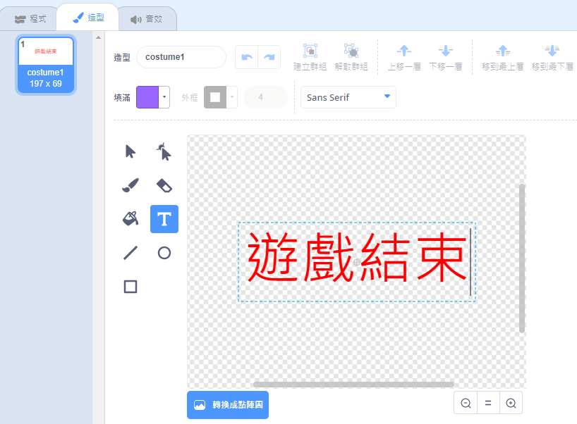
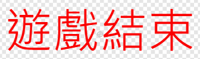

## 遊戲結束

接下來，你將在遊戲結束的時候顯示訊息。

\--- task \---

建立一個名為`生命`{:class="block3variables"}的變數。

讓你的飛船有三條命，一旦被河馬或橘子擊中就會失去一條生命。遊戲應該在`生命`{:class="block3variables"}用完時停止。

\--- /task \---

\--- task \---

畫個新角色，用**文字**工具加上字樣，然後命名為`遊戲結束`。



\--- /task \---

\--- task \---

在遊戲正好結束前，在舞台廣播`遊戲結束`{:class="block3events"}的訊息。


```blocks3
廣播訊息 (遊戲結束 v) 並等待
```

\--- /task \---

\--- task \---

在`遊戲結束`角色上編程，讓它在遊戲結束時再顯示：



```blocks3
當 @greenflag 被點擊
隱藏

當收到訊息 (遊戲結束 v)
顯示
```

因為你的舞台寫了`廣播訊息並等待`{:class="block3events"}程式，舞台就會等到`遊戲結束`角色出現前才停止遊戲。

\--- /task \---

\--- task \---

測試你的遊戲。你最多能拿多少分？如果遊戲太容易或太困難，你有什麼辦法改良它？

\--- /task \---