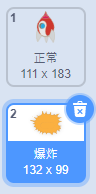
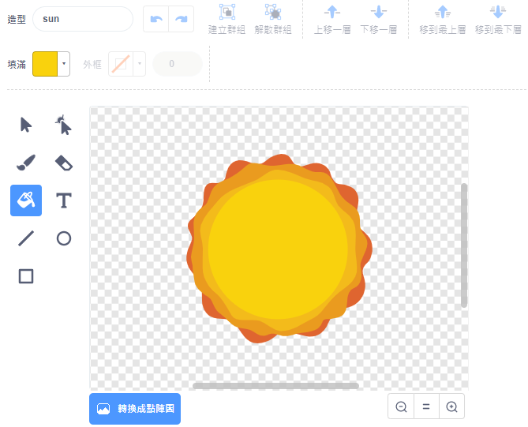

## 飛船爆炸

太空河馬衝撞到飛船時，你的飛船就會爆炸！

\--- task \---

選取`飛船`，切換到造型頁籤，把第一個造型重新命名成「正常」。

\--- /task \---

\--- task \---

添加一個新的造型，畫出飛船被撞到的樣子，並把它命名為「爆炸」。



如果你不想自己畫一個，可以選擇造型範例中的 Sun，然後用**填滿**等工具修改圖像的顏色或外觀。



\--- /task \---

\--- task \---

在`飛船`上添加一些程式，讓飛船在遊戲時顯示「正常」造型，在被河馬撞到時就「爆炸」：


```blocks3
當 @greenflag 被點擊
造型換成 (正常 v)
等待直到 <碰到 (河馬 v)？>
造型換成 (爆炸 v)
```

\--- /task \---

\--- task \---

測試你的程式，讓飛船和河馬相撞，飛船「爆炸」了嗎？

\--- /task \---