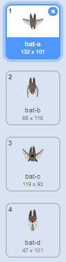

## 果蝠

為使遊戲難度增加，讓我們來製作一種向宇宙飛船扔橙子的果蝠。

+ 新增一個 `蝙蝠` 子圖，並將其旋轉方式設為僅 **左右**旋轉。

+ 使 `蝙蝠` 子圖 `永遠`{:class="blockcontrol"}橫跨工作區頂部從一邊向另一邊 `移動`{:class="blockmotion"}。請記得測試你的程式碼。


--- hints ---
--- hint ---
點選旗幟時，`蝙蝠` 子圖應永遠
- 移動 10 步
- 如果它到達邊緣，則返回
--- /hint ---
--- hint ---
以下是你將需要的程式碼：

```blocks
點選綠旗時
重複無限次 
  移動 (10) 點
  碰到邊緣就反彈
end
```
--- /hint ---
--- /hints ---

如果你觀察蝙蝠的造型，你會發現它已經具備兩種不同的造型：



+ 運用 `下一個造型`{:class="blocklooks"}程式碼塊來使蝙蝠邊移動邊扇動翅膀。

--- hints ---
--- hint ---
蝙蝠移動以後，就會顯示 `下一個造型`{:class="blocklooks"}，然後稍微 `等待`{:class="blockcontrol"}一會。
--- /hint ---
--- hint ---
以下是你將需要的程式碼：

```blocks
造型換成下一個
等待 (0.3) 秒
```
--- /hint ---
--- hint ---
以下為已新增新程式碼的完整程式碼：

```blocks
點選綠旗時
重複無限次 
  移動 (10) 點
  碰到邊緣就反彈
  造型換成下一個
  等待 (0.3) 秒
end
```
--- /hint ---
--- /hints ---

現在我們來讓蝙蝠扔橙子。

+ 從 Scratch 庫中新增新的 `橙子` 子圖。


+ 向你的蝙蝠新增程式碼，使得點選旗幟時，其等待 5 至 10 秒間的任意時間，然後建立一個 `橙子` 子圖的克隆體。

--- hints ---
--- hint ---
檢視你在建立 `閃電` 子圖時所寫的程式碼。你現在需要的程式碼與其十分相似，但橙子並不是在你按下**空格**鍵時出現的，而是在你 `等待`{:class="blockcontrol"}`5-10`{:class="blockoperators"}秒鐘之後出現的。
--- /hint ---
--- hint ---
`點選旗幟時`{:class="blockcontrol"}，`蝙蝠` 子圖應
`永遠`{:class="blockcontrol"}
- `等待`{:class="blockcontrol"}`5-10`{:class="blockoperators"}秒之間的 `任意`{:class="blockoperators"}時間
- 為 `橙子` 子圖 `建立一個克隆體`{:class="blockcontrol"}
--- /hint ---
--- hint ---
以下是你將需要的程式碼：

```blocks
點選綠旗時
重複無限次 
  等待 (隨機取數 (5) 到 (10)) 秒
  分身 [Orange v] 建立
end
```
--- /hint ---
--- /hints ---

+ 點選你的 `橙子` 子圖並新增一些程式碼，使每個 `橙子` 子圖克隆體下降，從 `蝙蝠` 子圖開始朝工作區底部降落。

--- hints ---
--- hint ---
你需要的此程式碼與 `閃電` 子圖內部的程式碼幾乎相同，但 `橙子` 子圖應 `前往`{:class="blockmotion"} `蝙蝠` 子圖的位置，並且其應該使用 `改變 y 座標`{:class="blockcontrol"}程式碼塊來向下移動，而非向上。
--- /hint ---
--- hint ---
以下是你將需要的程式碼：

```blocks
	點選綠旗時
隱藏

當分身產生
定位到 [Bat1 v] 位置
顯示
重複直到 <碰到 [邊緣 v] ?> 
  y 改變 (-4)
end
分身刪除

```
--- /hint ---
--- /hints ---


+ 向 `橙子` 子圖新增更多程式碼，使得 `宇宙飛船` 子圖在受撞擊時，它也會消失，並給玩家一個復位的機會：

```blocks
	當收到訊息 [hit v]
  分身刪除
```

+ 你還需要修改你的 `宇宙飛船` 子圖中的程式碼，使其在碰到 `河馬` 子圖或 `橙子` 子圖時受撞擊：

```blocks
	等待直到 <<碰到 [Hippo1 v] ?> 或 <碰到 [Orange v] ?>>
```

+ 測試你的遊戲。如果你被一個掉落的橙子擊中會發生什麼？
