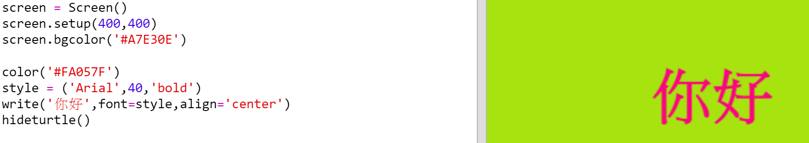

## 使用十六進位制顏色程式碼

Python的turtle模組中有一些預定義的顏色，比如“red”（紅色）和“white”（白色），但是你也可以使用顏色的十六進位制程式碼（你可能已經在HTML & CSS課程中看到過這樣的程式碼。）

+ 單擊連結<a href="http://jumpto.cc/python-new" target="_blank">jumpto.cc/python-new</a>，開啟空白的Python編碼頁面。

+ 新增以下的程式碼來匯入並使用turtle模組。
    
    
    
    請注意你已經使用了一個預定義的顏色：“white”（白色）。

+ Turtle模組含有一系列預定義的顏色名稱供你使用，但有時你想自己選擇喜歡的顏色。 所以turtle模組也允許你使用十六進位制的顏色程式碼。
    
    點選開啟<a href="http://jumpto.cc/colour-picker" target="_blank">jumpto.cc/colour-picker</a>連結，並選擇你喜歡的顏色。 找到該顏色的以“#”開頭的十六進位制程式碼，比如“#A7E30E”。

+ 複製這個十六進位制程式碼，包括開頭的井號（高亮選擇十六進位制程式碼，然後點選滑鼠右鍵並選擇“Copy”（複製），或按Ctrl-C快捷鍵）。

+ 現在更改設定螢幕顏色的程式碼行以使用你選擇的顏色。 例如：
    
    
    
    你可以滑鼠右鍵點選然後選擇“Paste”（貼上），或按Ctrl-V快捷鍵來將你的十六進位制顏色程式碼貼上到你的trinket程式中。

+ 選擇另外一個十六進位制顏色程式碼並使用它來設定文字的顏色。
    
    
    
    你不一定要使用“Arial”字型，也可以試一下“Verdana”，“Times”或“Courier”等字型。
    
    "40"是字型的大小，你也可以試試更改它。

+ 嘗試不同的顏色，直到你找到兩個你真正喜歡並且看上去搭配的顏色。