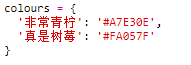
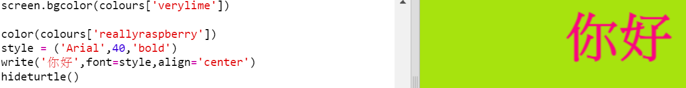

## 顏色字典

使用十六進位制顏色程式碼是非常靈活的, 但很難記住它們。

正如你可能已經知道的, 字典可以讓你查詢一個詞, 並檢視它的含義。 在Python中，字典更加靈活 - 它允許您查詢字典中任何“鍵”的值。

讓我們建立一個字典，將易於人腦記憶的顏色名稱（鍵名）對映到易於計算機處理的十六進位制程式碼（鍵值）。

+ 一個字典包含在一對花括號中。
    
    建立一個名 `colours` （顏色）的空白字典：
    
    

+ 為你的顏色選擇好聽的名字，然後編輯 `colours =` 行將它們以條目的形式新增到字典中。
    
    下面是一個顏色詞典的示例：
    
    
    
    鍵名（顏色名稱）與鍵值（十六進位制程式碼）之間使用冒號`:`分隔，而在"鍵名:鍵值"對之間則用一個英文逗號`,`分隔。

+ 現在你不需要記住那些十六進位制程式碼，你只需要在字典裡查詢它們就行了。
    
    調整以下程式碼以使用你自己的顏色名稱：
    
    
    
    將鍵名放到字典名稱後面的方括號“[]”內。

+ 現在，你可以更新你的程式碼，在字典中查詢顏色：
    
    

+ 測試程式碼以確保你的文字仍然正確顯示。