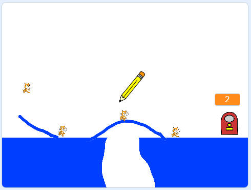

## What next?

Have a go at creating another game by working through the [CATS!](https://projects.raspberrypi.org/en/projects/cats?utm_source=pathway&utm_medium=whatnext&utm_campaign=projects) project.

--- no-print ---

Click and drag with the mouse to draw a line with the pencil. Your goal is to stop the cats from falling into holes by creating a safe path to the exit.

  <iframe allowtransparency="true" width="485" height="402" src="https://scratch.mit.edu/projects/embed/253667883/?autostart=false" frameborder="0" scrolling="no"></iframe>

--- /no-print ---

--- print-only ---

--- /print-only ---

If you want to make a game using Python instead of Scratch, try out the [RPG](https://projects.raspberrypi.org/en/projects/rpg?utm_source=pathway&utm_medium=whatnext&utm_campaign=projects) project.
