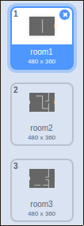
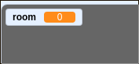
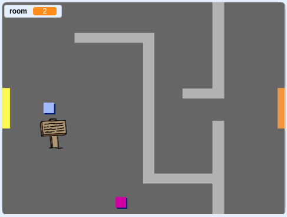

## Move around your world

The `player` sprite should be able to walk through doors into other rooms.

Your project contains backdrops for additional rooms:



--- task ---

Create a new 'for all sprites' variable called `room`{:class="block3variables"} to keep track of which room the `player` sprite is in.

[[[generic-scratch3-add-variable]]]



--- /task ---

--- task ---

When the `player` sprite touches the orange door in the first room, the game should display the next backdrop, and the `player` sprite should move back to the left side of the Stage. Add this code inside the `player` sprite's `forever`{:class="block3control"} loop:


```blocks3
when flag clicked
forever
	if <key (up arrow v) pressed? > then
		point in direction (0)
		move (4) steps
	end
	if <key (left arrow v) pressed? > then
		point in direction (-90)
		move (4) steps
	end
		if <key (down arrow v) pressed? > then
		point in direction (-180)
		move (4) steps
	end
		if <key [right arrow v] pressed? > then
		point in direction (90)
		move (4) steps
	end
	if < touching color [#BABABA]? > then
	move (-4) steps
	end
+	if < touching color [#F2A24A] > then
	switch backdrop to (next backdrop v)
	go to x: (-200) y: (0)
	change [room v] by (1)
	end
end
```

--- /task ---

--- task ---

Every time the game starts, the room, character position, and backdrop need to be reset.

Add code to the **start** of your `player` sprite code above the `forever`{:class="block3control"} loop, to reset everything when the flag is clicked:

--- hints --- 

--- hint ---

When the game starts:

+ The value of `room`{:class="block3variables"} should be set to `1`{:class="block3variables"}
+ The `backdrop`{:class="block3looks"} should be set to `room1`{:class="block3looks"}
+ The position of the `player` sprite should be set to `x: -200 y: 0`{:class="block3motion"}

--- /hint ---

--- hint ---

Here are the extra blocks you need:


```blocks3
go to x: (-200) y: (0)

set [room v] to (1)

switch backdrop to (room1 v)
```

--- /hint --- 

--- hint ---

Here's what your finished script should look like:


```blocks3
when flag clicked
+set [room v] to (1)
+go to x: (-200) y: (0)
+switch backdrop to (room1 v)
forever
	if <key (up arrow v) pressed? > then
		point in direction (0)
		move (4) steps
	end
	if <key (left arrow v) pressed? > then
		point in direction (-90)
		move (4) steps
	end
		if <key (down arrow v) pressed? > then
		point in direction (-180)
		move (4) steps
	end
		if <key [right arrow v] pressed? > then
		point in direction (90)
		move (4) steps
	end
	if < touching color [#BABABA]? > then
	move (-4) steps
	end
	if < touching color [#F2A24A] > then
	switch backdrop to (next backdrop v)
	go to x: (-200) y: (0)
	change [room v] by (1)
end
end
```

--- /hint --- 

--- /hints ---

--- /task ---

--- task ---

Click the flag, and then move your `player` sprite until it touches the orange door. Does the sprite move to the next screen? Does the `room`{:class="block3variables"} variable change to `2`?



--- /task ---


