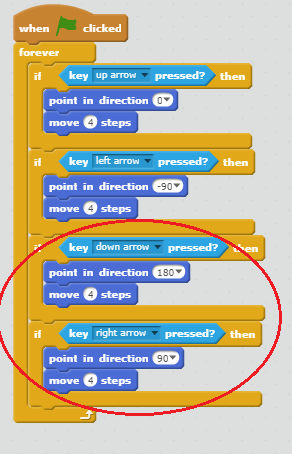

## 移动 `玩家` 子图

让我们从创建一个能在你的世界中四处走动的 `玩家` 子图开始。

+ 如果你正在线使用 Scratch，则在 [http://jumpto.cc/world-go](http://jumpto.cc/world-go){:target="_blank"} 打开“创建你自己的世界”Scratch 项目。如果你正离线使用 Scratch，则在[这里](http://jumpto.cc/world-get){:target="_blank"}下载项目，然后使用离线编辑器打开。  


玩游戏的人将使用箭头键使 `玩家` 子图四处移动。按下向上箭头时，你需要告诉 `玩家` 子图相应地向上移动，这样便能往正确的方向移动。

+ 向 `玩家` 子图添加此代码：

```blocks
	点击绿旗时
  重复无限次 
    如果 <[上移 v] 键被按下？> 那么 
      面朝 (0) 度
      移动 (4) 点
    end
  end
```

+ 通过点击旗帜然后按住向上箭头来测试你的 `玩家` 子图。你的 `玩家` 子图是否向上移动？

	

+ 为使 `玩家` 子图向左移动，你需要添加另一个 `如果`{:class="blockcontrol"}代码块，代码类似于：

```blocks
点击绿旗时
重复无限次 
  如果 <[上移 v] 键被按下？> 那么 
    面朝 (0) 度
    移动 (4) 点
  end
  如果 <[左移 v] 键被按下？> 那么 
    面朝 (-90) 度
    移动 (4) 点
  end
end
```

+ 向你的 `玩家` 子图添加更多代码，使其能向下和向右移动。运用你已有的代码来帮你。

--- hints ---
--- hint ---
为向上移动，你将 `玩家` 子图指向了 `0` 度方向。你要做什么才能使子图向下移动？

为向左移动，你将子图指向了 `-90` 度方向。你要做什么才能使子图向右移动？
--- /hint ---
--- hint ---
你将需要更改这两个代码块：
```blocks
<[ v] 键被按下？>
```
```blocks
面朝 () 度
```

复制你用于向上行进的代码，更改这两个代码块来使 `玩家` 子图向下移动。对向右移动进行同样操作。
--- /hint ---
--- hint ---
你的代码应如下所示：


--- /hint ---
--- /hints ---
