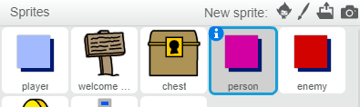

## 人物

让我们来向你的世界添加一些其他人物，你的 `玩家` 子图可与之进行互动。

+ 切换至 `人物` 子图。



+ 向 `人物` 子图添加一些代码，使该人物与 `玩家` 子图交谈。此代码与你在 `标志` 子图中所添加的代码十分相似：

```blocks
	点击绿旗时
  定位到 x: (0) y: (-150)
  重复无限次 
    如果 <碰到 [player v] ?> 那么 
      说出 [Did you know that you can go through orange and yellow doors?]

      说出 []
    end
  end
```

+ 你还可以通过在你代码的 `否则`{:class="blockcontrol"}部分添加这两个代码块，让你的 `人物` 子图移动：

```blocks
移动 (1) 点
碰到边缘就反弹
```

你的 `人物` 子图现在将会移动，但会停下来和 `玩家` 子图交谈。


--- challenge ---
### 挑战：完善人物
你能否向你的新 `人物` 子图添加代码，使其仅出现在房间 1 内？请务必测试你的新代码。

--- /challenge ---
