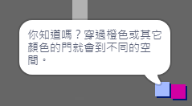

--- challenge ---
## 挑戰：擴充套件你的世界
你現在可以繼續建立你自己的世界！以下是一些想法：

+ 更改你的遊戲設定，並更改你的遊戲影象
+ 向你的遊戲新增聲音和音樂
+ 新增更多人物、敵人、標誌和硬幣
+ 新增紅色和黃色房門，以及開啟這些門的特殊鑰匙
+ 向你的世界新增更多房間
+ 向你的遊戲新增其他有用的物品

+ 使用硬幣從其他人物那裡獲取資訊：

+ 你甚至可以在房間 1 的北牆和南牆上新增房門，這樣玩家便可在四個方向上的房間之間移動。例如，如果你有九個房間，你可以考慮將它們以 3×3 的網格狀排列。然後，你可以將房間數量增加 `3` 來下移一級。

--- /challenge ---
