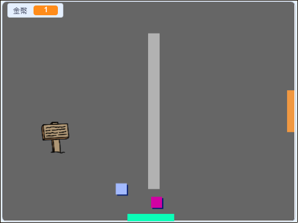
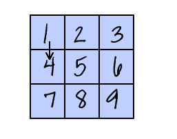

## 挑戰：拓展你的世界

你現在可以繼續創建屬於你的世界！ 給你一些靈感：

+ 在不同的空間加入更多的金幣。 在這些金幣旁佈下重兵守衛！
+ 修改遊戲的背景
+ 為遊戲添加音樂和音效
+ 加入更多的路人、敵人、告示牌
+ 增加紅色、黃色的門，還有能打開它們的鑰匙
+ 添加更多的空間（也就是關卡）
+ 在遊戲中放置些有功能的物品
    
    + 你必須給路人硬幣才能獲得情報：


+ 你還可以打通北牆和南牆，在上面添加門，這樣玩家就可以在四個方向的空間移動。 舉例來說，你的遊戲像是放在 3x3 的格子中，這樣就有 9 個空間。 然後，往下的空間就是把空間數字加 `3`。





```blocks3
如果 <碰到顏色 ()？> 那麼
背景換成 ((造型 [編號 v]::looks) + (3))
定位到 x:(0) y:(200)
變數 [空間 v] 改變 (3)
```