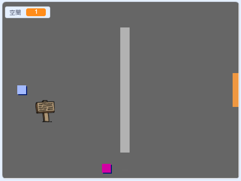

## 移動玩家角色

先從創建一個能在你的世界中移動的 `玩家` 角色開始。

\--- task \---

開啟 Create your own world 這個範例專案。

**線上版**：你可以連結 [rpf.io/create-your-own-world-on](http://rpf.io/create-your-own-world-on){:target="_blank"} 以新建專案。

如果你有 Scratch 帳戶，你就可以直接**改編**專案。

**離線版**：你可以點擊 [rpf.io/p/en/create-your-own-world-go](http://rpf.io/p/en/create-your-own-world-go){:target="_blank"} 以下載專案。 如果你需要 Scratch 離線版編輯器，可以連結到 [rpf.io/scratchoff](https://rpf.io/scratchoff){:target="_blank"}。



\--- /task \---

方向鍵應該要能控制`角色`的移動。 比方說，向上鍵要能讓`玩家`角色往舞台的上方移動。

\--- task \---

在`玩家`角色上添加這個程式：


```blocks3
當 @greenflag 被點擊
重複無限次
    如果 <(向上 v) 鍵被按下？ > 那麼
        面朝 (0) 度
        移動 (4) 點
    end
end
```

\--- /task \---

\--- task \---

點擊綠旗，然後按住向上鍵。 `玩家`角色往上移動了嗎？


\--- /task \---

\--- task \---

要讓`玩家`角色向左移動的話，你必須添加另一個`如果`{:class="block3control"}積木，然後撰寫類似的程式：


```blocks3
當 @greenflag 被點擊
重複無限次
    如果 <(向上 v) 鍵被按下？ > 那麼
        面朝 (0) 度
        移動 (4) 點
    end
+  如果 <(向左 v) 鍵被按下？ > 那麼
        面朝 (-90) 度
        移動 (4) 點
    end
end
```

\--- /task \---

\--- task \---

編寫更多的程式，讓`玩家`角色也能向下、向右移動。 你可以複製現有的程式然後加以修改，幫助你快一點完成。

\--- hints \---

\--- hint \---

在向上移動時，`玩家`角色要面對的方位角度是 `0` 度。 那麼往下移動呢？

在向左移動時，玩家角色要面對的方位角度是 `90` 度。 那麼往右移動呢？

\--- /hint \---

\--- hint \---

你必須要修改這兩種積木：


```blocks3
<( v) 鍵被按下？>

面朝 () 度
```

複製讓`玩家`能往上移動的程式，修改這兩種積木，讓角色能向下移動。 再複製一次，然後把它改成能讓角色向右移動。

\--- /hint \---

\--- hint \---

你的程式看起來應該像這樣：


```blocks3
當 @greenflag 被點擊
重複無限次
    如果 <(向上 v) 鍵被按下？ > 那麼
        面朝 (0) 度
        移動 (4) 點
    end
    如果 <(向左 v) 鍵被按下？ > 那麼
        面朝 (-90) 度
        移動 (4) 點
    end
+    如果 <(向下 v) 鍵被按下？ > 那麼
        面朝 (180) 度
        移動 (4) 點
    end
+    如果 <(向右 v) 鍵被按下？ > 那麼
        面朝 (90) 度
        移動 (4) 點
    end
end
```

\--- /hint \---

\--- /hints \---

\--- /task \---