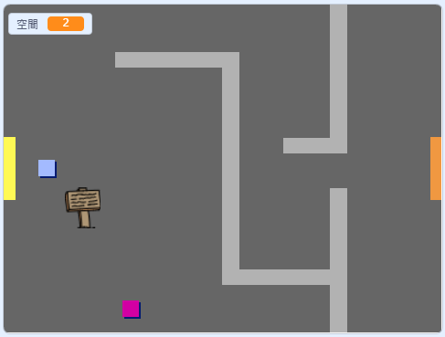

## 對你的世界進行編碼

我們來讓 `玩家` 子圖穿過房門進入其他房間。

你的專案包含其他房間的背景：


+ 建立一個名為 `房間`{:class="blockdata"}的“適用所有子圖”的新變數，來追蹤 `玩家` 子圖所在的房間。

[[[generic-scratch-add-variable]]]


+ 當 `玩家` 子圖碰到第一個房間的橙色房門時，應顯示下一個背景，然後 `玩家` 子圖應返回工作區的左邊。將此程式碼新增進 `玩家` 子圖的 `永遠`{:class="blockcontrol"}迴圈：

```blocks
	如果 <碰到顏色 [#F2A24A] ?> 那麼 
    背景換成 [next backdrop v]
    定位到 x: (-200) y: (0)
    變數 [room v] 改變 (1)
  end
```

+ 向你的 `玩家` 子圖程式碼（`永遠`{:class="blockcontrol"}迴圈上方）的**開頭**新增此程式碼，以確保點選旗幟時所有內容都被重置：

	```blocks
		變數 [room v] 設為 (1)
    定位到 x: (-200) y: (0)
    背景換成 [room1 v]
	```

+ 點選旗幟並使你的 `玩家` 子圖移動到橙色房門上。你的子圖是否移向了下一個畫面？`room`{:class="blockdata"}（房間）變數是否變為 `2`？



--- challenge ---
### 挑戰：移向先前的房間

+ 你能否使你的 `玩家` 子圖在碰到黃色房門時移向先前的房間？為此你需要的程式碼與你之前為移向下一個房間而新增的程式碼十分相似。

--- /challenge ---
