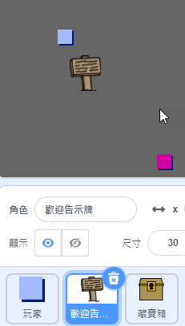
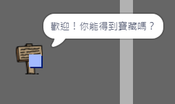

## 標誌

讓我們向你的世界新增一些標誌，以指引玩家的旅程。

+ 你的專案包括一個 `歡迎標誌` 子圖：



+ `歡迎標誌` 子圖只應在房間 1 中可見，因此向 `歡迎標誌` 子圖新增一些程式碼以確保實現這一點：

```blocks
	點選綠旗時
  重複無限次 
    如果 <(room) = [1]> 那麼 
      顯示

      隱藏
    end
  end
```

+ 通過在房間之間移動來測試你的 `歡迎標誌` 子圖。你的標誌只應在房間 1 中可見。

	

+ 一個標誌如果不能表示點什麼，則沒有多大用處！新增更多程式碼，使 `歡迎標誌` 子圖觸碰到 `玩家` 子圖時顯示一條資訊：

```blocks
	點選綠旗時
  重複無限次 
    如果 <(room) = [1]> 那麼 
      顯示

      隱藏
    end
    如果 <碰到 [player v] ?> 那麼 
      說出 [Welcome! Can you get to the treasure?]

      說出 []
    end
  end
```

+ 測試你的 `歡迎標誌` 子圖 — 現在，`玩家` 子圖觸碰它時，你應該會看到一條資訊。


