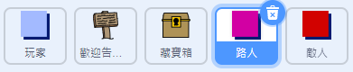

## 人物

讓我們來向你的世界新增一些其他人物，你的 `玩家` 子圖可與之進行互動。

+ 切換至 `人物` 子圖。



+ 向 `人物` 子圖新增一些程式碼，使該人物與 `玩家` 子圖交談。此程式碼與你在 `標誌` 子圖中所新增的程式碼十分相似：

```blocks
	點選綠旗時
  定位到 x: (0) y: (-150)
  重複無限次 
    如果 <碰到 [player v] ?> 那麼 
      說出 [Did you know that you can go through orange and yellow doors?]

      說出 []
    end
  end
```

+ 你還可以通過在你程式碼的 `否則`{:class="blockcontrol"}部分新增這兩個程式碼塊，讓你的 `人物` 子圖移動：

```blocks
移動 (1) 點
碰到邊緣就反彈
```

你的 `人物` 子圖現在將會移動，但會停下來和 `玩家` 子圖交談。


--- challenge ---
### 挑戰：完善人物
你能否向你的新 `人物` 子圖新增程式碼，使其僅出現在房間 1 內？請務必測試你的新程式碼。

--- /challenge ---
