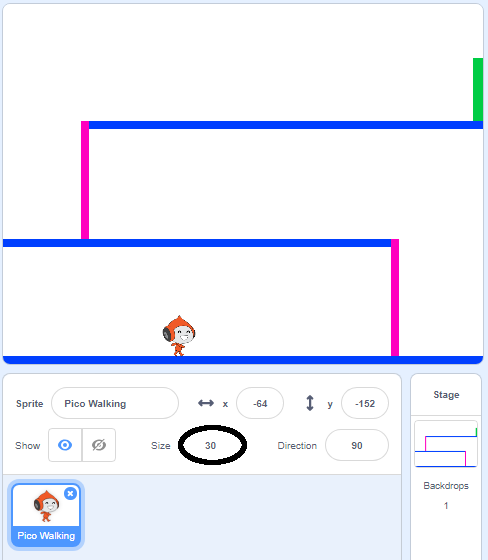
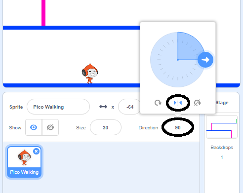

## Character movement

Start by creating a character that can move left and right, and can climb up ladders.

--- task ---

Open the 'Dodgeball' Scratch starter project.

**Online:** open the starter project at [rpf.io/dodgeball-on](http://rpf.io/dodgeball-on){:target="_blank"}. 

If you have a Scratch account you can make a copy by clicking **Remix**.

**Offline:** download the starter project from [rpf.io/p/en/dodgeball-get](http://rpf.io/p/en/dodgeball-get) and then open it using the offline editor.

--- /task ---

The project contains a backdrop with platforms:


--- task ---

Choose a new sprite as the character the player will control, and add it to your project. It's best if you choose a sprite with multiple costumes, so that you can make it look as though it's walking.


[[[generic-scratch3-sprite-from-library]]]

--- /task ---

--- task ---

Add code blocks to your character sprite so that the player can use the arrow keys to move the character around. When the player presses the right arrow, the character should point right, move a few steps, and change to the next costume:


```blocks3
when flag clicked
forever
	if <key (right arrow v) pressed? > then
		point in direction (90 v)
		move (3) steps
		next costume
	end
end
```

--- /task ---

--- task ---

If your sprite doesn't fit, adjust its size.



--- /task ---

--- task ---

Test out your character by clicking the flag and then holding down the right arrow key. Does your character move to the right? Does your character look like it is walking?


--- /task ---

--- task ---

Add code blocks to the character sprite's `forever`{:class="block3control"} loop so that it walks left if the left arrow key is pressed.

--- hints ---

--- hint ---

So that your character can move to the left, you'll need to add another `if`{:class="block3control"} block inside the `forever`{:class="block3control"} loop. In this new `if`{:class="block3control"} block, add code to make your character sprite `move`{:class="block3motion"} to the left.

--- /hint ---

--- hint ---

Copy the code you created to make the character walk to the right. Then set the `key pressed`{:class="block3sensing"} to the `left arrow`{:class="block3sensing"}, and change the `direction`{:class="block3motion"} to `-90`.

```blocks3
if <key (right arrow v) pressed? > then
	point in direction (90 v)
	move (3) steps
	next costume
end
```

--- /hint ---

--- hint ---

Your code should look like this now:


```blocks3
when green flag clicked
forever 
  if <key (right arrow v) pressed?> then 
    point in direction (90 v)
    move (3) steps
    next costume
  end
  if <key (left arrow v) pressed?> then 
    point in direction (-90 v)
    move (3) steps
    next costume
  end
end
```

--- /hint ---

--- /hints ---

--- /task ---

--- task ---

Test your new code to make sure that it works. Does your character turn upside-down when walking to the left?


If so, you can fix this by clicking on the **direction** of your character sprite, and then clicking on the left-right arrow.



Or if you prefer, you can also fix the problem by adding this block to the start of your character's script:

```blocks3
set rotation style [left-right v]
```

--- /task ---

--- task ---

To climb a pink ladder, your character sprite should move a few steps upwards on the Stage whenever the up arrow is pressed **and** the character is touching the correct colour. 

Add inside your character's `forever`{:class="block3control"} loop to `change`{:class="block3motion"} the character's `y` (vertical) position `if`{:class="block3control"} the `up arrow is pressed`{:class="block3sensing"} and the character is `touching the colour pink`{:class="block3sensing"}.


```blocks3
	if < <key (up arrow v) pressed?> and <touching color [#FF69B4]?> > then
		change y by (4)
	end
```

--- /task ---

--- task ---

Test your code. Can you make the character climb the pink ladders and get to the end of the level?


--- /task ---
