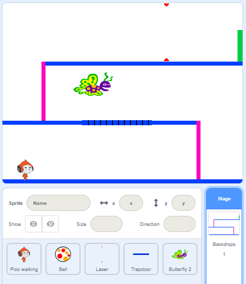

## Challenge: more obstacles

If you think your game is still too easy, you can add more obstacles to it. The obstacles can be anything you like! Here are some ideas:

+ A dangerous butterfly
+ Platforms that appear and disappear
+ Falling tennis balls that must be avoided



You could even design another backdrop to create the next level. Then add code so that, when your character reaches the green door, the game switches to the new background:


```blocks3
	if <touching color [#00FF00]?> then
		switch backdrop to (next backdrop v)
		go to x: (-210) y: (-120)
		wait (1) seconds
	end
```
