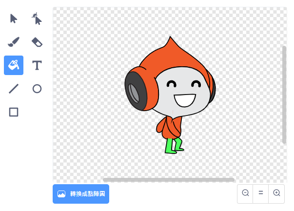

## 挑戰：改良重力

你的遊戲還存在一個小小的 Bug：如果角色的**任何一個部位**碰到藍色的平台，就不會有重力。 也就是說，如果角色的頭部碰到這個平台，角色就會「掛」在半空中了！ 不相信的話你自己試試：讓你的角色爬到梯子上，然後往接近平台下方處跳躍或是移動角色。


要修復這個小小的錯誤，你先要為角色穿上一件不同顏色的褲子（注意：角色的**每個造型**都要這麼做）。



然後找到以下的程式積木：

```blocks3
    < 碰到顏色 [#0000FF]? >
```

把上面的積木換成：

```blocks3
    < 顏色 (#00FF00) 碰到顏色 (#0000FF)？ >
```

檢查一下，bug 修好了嗎？