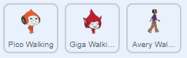
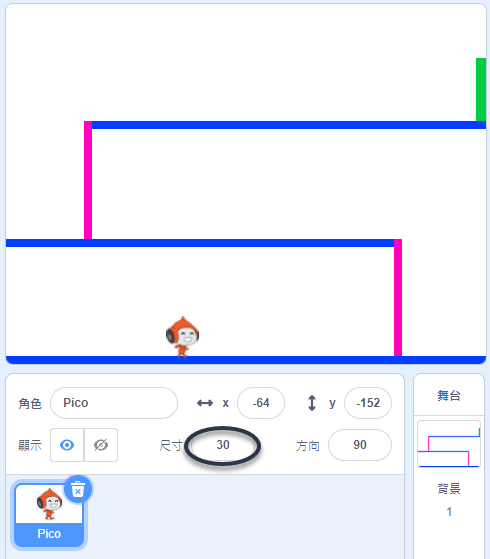
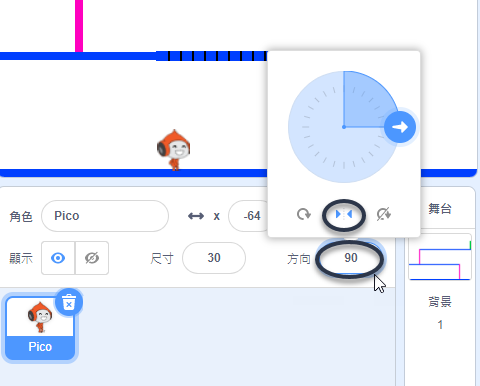

## 角色的動作

我們先創建一個角色，這個角色可以在地面前後移動，可以在梯子爬上爬下。

\--- task \---

打開躲避球這個專案的材料包。

**線上版：**你可以連結 [rpf.io/dodgeball-on](http://rpf.io/dodgeball-on){:target="_blank"} 以新建專案。

如果你有 Scratch 帳戶，你就可以直接**改編**專案。

**離線版：** 你可以點擊 [rpf.io/p/en/dodgeball-get](http://rpf.io/p/en/dodgeball-get){:target="_blank"} 以下載專案。

\--- /task \---

這個材料包裡有個已經做好的平台背景：


\--- task \---

加入一個玩家要控制的角色。 建議選擇有多個造型的角色，這樣就可以設計動畫，讓它看起來像是真的在走路。你可以在選角色的時候輸入關鍵字 Walking（走路）來篩選。



[[[generic-scratch3-sprite-from-library]]]

\--- /task \---

\--- task \---

為角色編寫程式，讓玩家能透過鍵盤上的方向鍵讓角色移動。 當玩家按住向右鍵，角色應該會面向右邊，移動固定的點數，然後換下一個走路的造型：


```blocks3
當 @greenflag 被點擊
重複無限次
    如果 <(向右 v) 鍵被按下？ > 那麼
        面朝 (90) 度
        移動 (3) 點
        造型換成下一個
    end
end
```

\--- /task \---

\--- task \---

如果你覺得角色看起來太大或太小，可以調整它的尺寸。



\--- /task \---

\--- task \---

點擊綠旗開始遊戲，按住向右鍵，測試看看角色是不是正常運行。 你的角色會往右邊移動嗎？ 你的角色看起來像真的在走路嗎？


\--- /task \---

\--- task \---

在角色的`重複無限次`{:class="block3control"}迴圈中添加一些程式，讓它也能夠向左邊移動。

\--- hints \---

\--- hint \---

為了要讓角色往左邊移動，我們把`如果`{:class="block3control"}積木放到 `重複無限次`{:class="block3control"}迴圈裡面。 在新的`如果`{:class="block3control"}積木之後添加程式，讓你的角色能`移動`{:class="block3motion"}到舞台的左側。

\--- /hint \---

\--- hint \---

找到之前寫過的向右移動的程式，把它複製下來。 然後把`按鍵按下`{:class="block3sensing"}所要偵測的按鍵改成`向左鍵`{:class="block3sensing"}，接著把`面朝的角度`{:class="block3motion"}改成 `-90`。

```blocks3
如果 <(向右 v) 鍵被按下？ > 那麼
    面朝 (90) 度
    移動 (3) 點
    造型換成下一個
end
```

\--- /hint \---

\--- hint \---

你的程式應該會像這樣：


```blocks3
當 @greenflag 被點擊
重複無限次
  如果 <(向右 v) 鍵被按下？> 那麼
    面朝 (90) 度
    移動 (3) 點
    造型換成下一個
  end
  如果 <(向左 v) 鍵被按下？> 那麼
    面朝 (-90) 度
    移動 (3) 點
    造型換成下一個
  end
```

\--- /hint \---

\--- /hints \---

\--- /task \---

\--- task \---

測試你的新程式，檢查有沒有像預期那樣運作。 向左走時，角色的外觀是不是顛倒過來了？


如果發生這個狀況，你可以從角色面板找到**方向**，點擊它，把迴轉方式改成「左-右」。



或者，你也可以用寫程式的方法來解決這個問題：

```blocks3
迴轉方式設為 [左-右 v]
```

\--- /task \---

\--- task \---

要爬上桃紅色梯子的條件是，玩家要按向上鍵，**並且**角色正好碰到了這個顏色，才能讓角色爬上去。

在角色的`重複無限次`{:class="block3control"}迴圈裡添加一些程式，`如果`{:class="block3control"}玩家按了`向上鍵`{:class="block3sensing"}，而且角色正好`碰到了桃紅色`{:class="block3sensing"}，那麼就`改變`{:class="block3motion"}角色的垂直位置，也就是 `y` 座標。


```blocks3
    如果 <<(向上 v) 鍵被按下？> 且 <碰到顏色 (#ff69b4)？>> 那麼
        y 改變 (4)
    end
```

\--- /task \---

\--- task \---

測試你的程式。 你的角色能爬上桃紅色的梯子，然後走到遊戲的終點（舞台最右上方的綠色方塊）嗎？


\--- /task \---