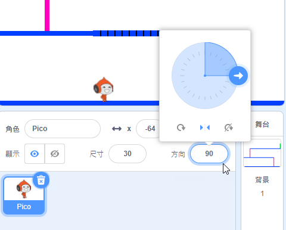

## 角色移動

讓我們首先建立一個可左右移動並可攀爬梯子的角色。


+ 從 <a href="http://jumpto.cc/dodge-go" target="_blank">jumpto.cc/dodge-go</a> 線上開啟“躲避球”Scratch 專案，如果你正使用離線編輯器，則從 <a href="http://jumpto.cc/dodge-get" target="_blank">jumpto.cc/dodge-get</a> 下載，然後開啟。

	該專案包含一個帶有平臺的背景：

	

+ 新增一個新的子圖，該子圖將成為你的角色。你最好選擇一個帶有多種造型的子圖，這樣你能使其看起來像是在行走。

	

+ 讓我們使用箭頭鍵使你的角色到處移動。當玩家按下右箭頭鍵時，你希望你的角色朝向右側、移動幾步並變換為下一套造型：

	```blocks
		點選綠旗時
    重複無限次 
      如果 <[右移 v] 鍵被按下？> 那麼 
        面朝 (90 v) 度
        移動 (3) 點
        造型換成下一個
      end
    end
	```

+ 通過點選旗幟然後按住右箭頭鍵來測試你的角色。你的角色是否向右移動？你的角色看起來是否正在行走？

	

+ 為使你的角色向左移動，你需要在你的 `重複執行`{:class="blockcontrol"}迴圈內部新增另一個 `如果`{:class="blockcontrol"}程式碼塊，來使你的角色左移。

+ 測試你的新程式碼來確保其正常執行。你的角色是否在向左行走時上下顛倒？

	

	如果是，你可以通過點選角色子圖上的 `(i)`{:class="blocksensing"} 圖示修復這個錯誤，然後點選左右箭頭。

	

	或者，如果你願意的話，你可以在你角色指令碼的開始位置新增此程式碼塊：

	```blocks
    迴轉方式設為 [左-右 v]
	```

+ 為攀爬粉色梯子，你的角色應該在每次按下上箭頭時略微上移，並且觸碰到正確的顏色。將此程式碼新增進你角色的 `重複執行`{:class="blockcontrol"}迴圈中：

	```blocks
		如果 <<[上移 v] 鍵被按下？> 且 <碰到顏色 [#FF69B4] ?>> 那麼 
      y 改變 (4)
    end
	```

+ 測試你的角色 - 你能否攀爬粉色梯子併到達關卡的終點？

	


