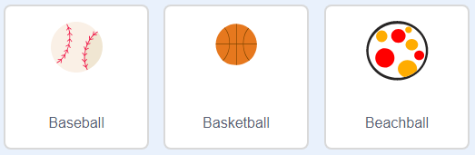

## 躲避的球

你已經賦予了角色移動和跳躍的能力了，現在，我們來給角色製造一些麻煩吧。

\--- task \---

創建一個新的球角色。 你可以選擇任何你喜歡的球。你可以在角色範例庫中輸入關鍵字 ball（球）來篩選角色。



\--- /task \---

\--- task \---

調整球的尺寸，要讓玩家角色能跳的過去。 測試看看，如果跳不過去，就把球的尺寸縮小些，又或者，回到上個步驟，把跳躍的高度給修改一下。


\--- /task \---

\--- task \---

為球角色編寫這個程式：


```blocks3
當 @greenflag 被點擊
隱藏
重複無限次
  等待 (3) 秒
  建立 (自己 v) 的分身
end
```

```blocks3
當分身產生
定位到 x:(160) y:(160)
顯示
重複 (22) 次
  y 改變 (-4)
end
重複 (170) 次
  x 改變 (-2)
  左轉 @turnright (6) 度
end
重複 (30) 次
  y 改變 (-4)
end
分身刪除
```

這個程式是用來製造球角色的分身，每 3 秒建立一次， 每個新的球分身都會從舞台右上角開始掉落，然後在平台上滾動。

\--- /task \---

\--- task \---

點擊綠旗開始測試遊戲。


\--- /task \---

\--- task \---

為你的球角色添加更多程式，讓它能在三個平台上移動。


\--- hints \---

\--- hint \---

複製你用在第一個平台上移動球角色的程式， 只要修改 `x`{:class="block3motion"}、`y`{:class="block3motion"}，還有`重複`{:class="block3control"} 的值，讓分身能正確的順著平台移動。

\--- /hint \---

\--- hint \---

這裡是你需要的程式積木， 想想看，怎麼安排順序才能讓球正確滾動？


```blocks3
重複 (170) 次
  x 改變 (-2)
  左轉 @turnleft (6) 度
end

重複 (180) 次
  x 改變 (2)
  右轉 @turnright (6) 度
end

重複 (30) 次
  y 改變 (-4)
end
```

\--- /hint \---

\--- hint \---

球角色的程式看起來會像這樣：


```blocks3
當分身產生
定位到 x:(160) y:(160)
顯示
重複 (22) 次
  y 改變 (-4)
end
重複 (170) 次
  x 改變 (-2)
  左轉 @turnleft (6) 度
end
重複 (30) 次
  y 改變 (-4)
end
重複 (180) 次
  x 改變 (2)
  右轉 @turnright (6) 度
end
重複 (30) 次
  y 改變 (-4)
end
重複 (170) 次
  x 改變 (-2)
  左轉 @turnleft (6) 度
end
分身刪除
```

\--- /hint \---

\--- /hints \---

\--- /task \---

\--- task \---

現在添加一些程式，讓玩家角色在撞到球時廣播一個訊息！

要在球角色上添加的程式會像這樣：


```blocks3
    當分身產生
    重複無限次
        如果 <碰到 (Pico v)？ > 那麼
            廣播訊息 (擊中了 v)
        end
    end
```

\--- /task \---

\--- task \---

最後，在你的角色上再寫些程式，讓它在收到`擊中了`訊息時回到一開始的位置，重新再來一次。


```blocks3
    當收到訊息 (擊中了 v)
    面朝 (90) 度
    定位到 x:(-210) y:(-120)
```

\--- /task \---

\--- task \---

測試你的程式。 在球碰到角色後，看看角色是不是會回到起始位置。

\--- /task \---