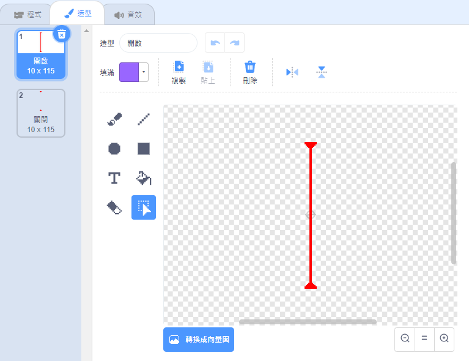
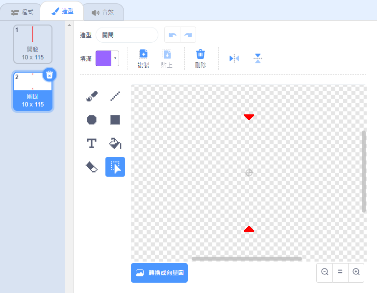

## 動感光波！

為了增加遊戲的難度，你將在遊戲中添加雷射槍！

\--- task \---

繪製一個新的角色，名為`雷射`。 給它兩種造型：一個是「開啟」，另一種是「關閉」。





\--- /task \---

\--- task \---

將新發明的雷射放在終點前面，來個出奇不意。


\--- /task \---

\--- task \---

為你的雷射編寫程式，讓它在遊戲過程中開開關關，也就是在兩個造型之間切換。


```blocks3
    當 @greenflag 被點擊
    重複無限次
        造型換成 (開啟 v)
        等待 (2) 秒
        造型換成 (關閉v)
        等待 (2) 秒
    end
```

如果你有辦法的話，就把程式中切換造型的`等待`{:class="block3control"}的時間改成`不固定`{:class="block3operators"}，這樣一來玩家就沒辦法預測雷射發出的時間，成為了名副其實的「動感」光波。

\--- /task \---

\--- task \---

最後，在雷射角色上再添加一些程式，讓玩家在碰到雷射後廣播「擊中了」的訊息。

\--- hints \---

\--- hint \---

這個程式和玩家被球擊中時的程式很類似。

\--- /hint \---

\--- hint \---

找到你在球角色的這個程式，也就是如果`碰到角色`{:class="block3sensing"}就`廣播擊中了的訊息`{:class="block3control"}的那段程式。

\--- /hint \---

\--- hint \---

這裡是你應該添加的程式：


```blocks3
當 @greenflag 被點擊
重複無限次
  如果 <碰到 (Pico v)？> 那麼
    廣播訊息 (擊中了 v)
  end
end
```

\--- /hint \---

\--- /hints \---

你不需要再為玩家角色編寫其它的程式，因為它已經知道在接收到`擊中了`{:class="block3control"}的訊息後要做些什麼！

\--- /task \---

\--- task \---

測試你的遊戲，看看是否可以讓雷射槍發出動感光波！ 如果你覺得雷射太容易或太難躲過，你可以調整一下雷射開關的`等待時間`{:class="block3control"}。

\--- /task \---