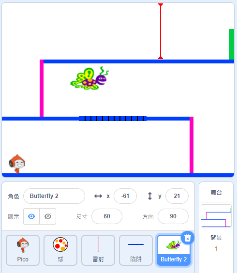

## 挑戰：更多阻礙

如果你覺得遊戲太簡單，可以試著添加更多煩人的障礙物。 你喜歡什麼阻礙就給它加上去！ 給你一些好點子：

+ 四處亂飛的蝴蝶
+ 隨時消失的平台
+ 從天而降的網球



你還可以設計下一個背景， 當角色抵達終點（綠色的方塊）後，切換到下一個背景，這樣一來你的遊戲就變成關卡式的遊戲了：


```blocks3
    如果 <碰到顏色 (#00ff00)？> 那麼
        背景換成 (下一個背景 v)
        定位到 x:(-210) y:(-120)
        等待 (1) 秒
    end
```